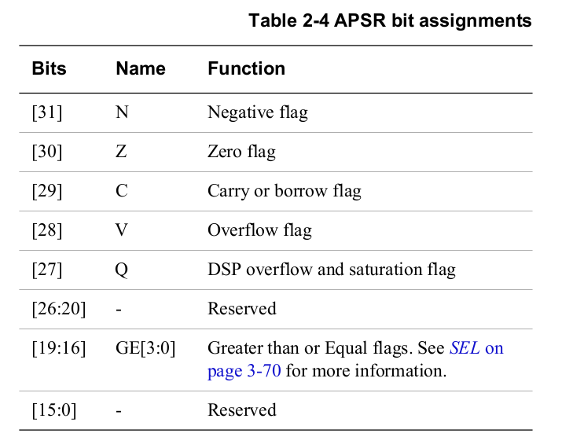
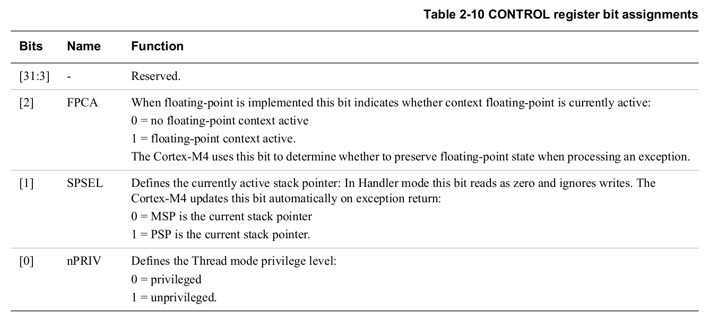
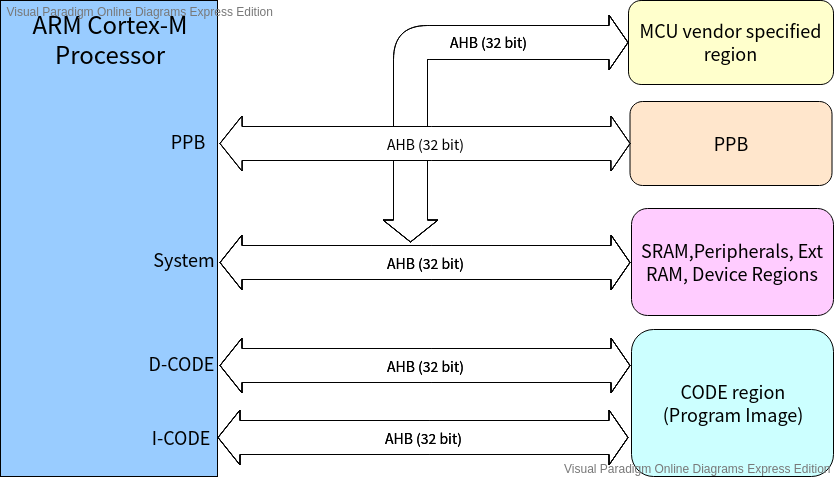
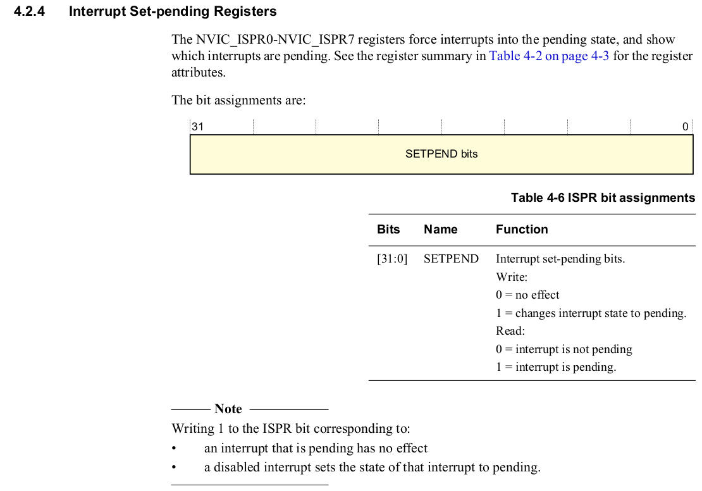

# ARM Cortex-M ( Cortex M0/M3/M4 processor)
This repository is my learning notes of the ARM Cortex-M.

## Features
1. Operational mode of the processor
2. The difference access levels of the process
3. The register set of the processor
4. The banked stack design of the process
5. Exceptions and exception handling
6. Interrupt handling
7. Buss interfaces and bus matrix
8. Memory architecture of the process, bit banding, memory map, etc.
9. Endianness
10. Aligned and unaligned data transfer
11. Bootloader and IAP


## Operational mode
Processor gives 2 operation modes
* **Thread mode** : Used to execute application software. The process enters Thread mode when is comes out of reset. (Privilege access level or unprivileged access level)
* **Handler mode** : Used to handle exception. The processor returns to Thread mode when it has finished all exception processing. (Only can be privileged access level)

1. All your application code will execute under "Thread mode" of the processor. This is also called as "User Mode".
2. All the exceptions handlers or interrupt handlers will run under the "Handler mode" of the processor.
3. Processor always starts with "Thread mode"
4. Whenever the code meets the system exception or any external interrupts then the core will change its mode to handler mode in order to service the ISR associated with that system exception or the interrupt.


## Access Levels
1. Processor offers 2 access levels
    * Privilege Access Level (PAL)
    * Non-Privileged Access Level (NPAL)
2. If your code is running with PAL, then your code has full access to all the processor specific resources and restricted registers.
3. If your code is running with NPAL, then your code may not have access to some of restricted registers of the processor.
4. **By default your code will run in PAL.**
5. **When the processor is in "Thread mode", its possible to move process into NPAL. Once you move out of the PAL to NPAL being in thread mode, then its not possible to come back to PAL unless you change the processor operational mode to "Handler mode".**
6. **"Handler mode" code execution is always with PAL**.
7. Use the **CONTROL** register of the processor if you want to switch between the access levels.


## Core Registers


* All the core register are **32 bits** wide

---

### R0-R12

* Total 13 registers are for general purpose

---

### R13 - SP (Stack Pointer)

* The register R13 is called as SP. It  is used to track the memory
* Beside the SP, two more registers are mentioned
  * **PSP** which stands for process stack pointer
  * **MSP** which stands for main stack pointer.
  * There register are called as Banked version of stack pointer.

---

### R14 - LR (Link Register)

* The register R14 is called as LR (Link Register)
*  It stores the return information for subroutines, function calls, and exceptions.
* LR has two different values on function call and interrupt/exception.


#### Function calls

* The LR saves the *return address*, because PC is callee function


#### Interrupt/Exception

* The LR saves *EXC_RETURN* value not return address. Return address is kept by PC.


---

### R15 - PC (Program Counter)

* The register R15 is called as **PC**.
* It holds the address of the next instruction to be executed.
* On reset, the processor loads the PC with the value of the reset vector, which is at address 0x00000004.

---

### PSR (Program Status Register)

* PSR combines combines three difference register:


#### APSR (Application Program Status Register)

* The APSR contains the current state of the condition flags form previous instruction executions.




#### IPSR (Interrupt Program Status Register)

* The IPSR contains the exception type number of the current Interrupt Service Routine (ISR).


#### EPSR (Execution Program Status Register)


## Memory mapped register and Non-memory mapped registers ##
1. Core register is non-memory mapped register. The registers do not have unique addresses to access them. You cannot access these register in a 'C' program using address dereferencing. To access these registers, you have to use assembly instructions.
2. Memory mapped registers has its address in the processor memory map. You can access these registers in a 'C' program using address dereferencing.
    * Registers of the processor specific peripherals (NVIC, MPU, SCB, DEBUG, etc.)
    * Registers of the Microcontroller specific peripherals (RTC, I2C, TIMER, CAN, USB, etc.)


## ARM GCC inline assembly code usage ##
* Inline assembly code is used to write pure assembly code inside a 'C' program

* GCC inline assembly code syntax as shown below:
    - Assembly instruction: `MOVE R0,R1`
    - Inline assembly statement: `__asm volatile("MOVE R0,R1");`
    ```assembly
    void fun_add(void)
    {
        __asm volatile("LDR R0,[R1]");
        __asm volatile("LDR R1,[R2]");
        __asm volatile("ADD R1,R0");
        __asm volatile("STR R1,[R3]");

        __asm volatile(
            "LDR R0,[R1]\n\t"
            "LDR R1,[R2]\n\t"
            "ADD R1,R0\n\t"
            "STR R1,[R3]\n\t"
            );
    }
    ```
    
* General form of an inline assembly statement
    **```__asm volatile(code : output operand list : input operand list : clobber list);```**
    * volatile: Instruct the compiler not to optimize the assembler code.
    * code: Assembly mnemonic defined as a single string.
    * output operand list: A list of output operands, separated by commas.
    * input operand list: A list of input operands, separated by commas.
    * clobber list: It is mainly used to tell the compiler about modifications done by the assembly code.
    ```assembly
    __asm volatile("MOV R0,R1");
    __asm volatile("MOVE R0,R1":::);
    ```

>  Example: Load 2 values from memory, add them and store the result back to the memory using inline assembly statements.

```assembly
int main(void)
{
	__asm volatile("LDR R1,=#0x20001000");
	__asm volatile("LDR R2,=#0x20001004");
	__asm volatile("LDR R0,[R1]");
	__asm volatile("LDR R1,[R2]");
	__asm volatile("ADD R0,R0,R1");
	__asm volatile("STR R0,[R2]");

	for(;;);
}
```


### Input/output operands and Constraint string ###

Each input and output operand is described by a constraint string followed by a C expression in parentheses.
```
"<Constraint string>"(<C expression>)
```
Constraint string = constraint character + constraint modifier

#### *Example 1: Move the content of C variable val to ARM register R0* ####
```
	__asm volatile("MOV R0,%0": :"r"(val));
 80001f2:	687b      	ldr	r3, [r7, #4]
 80001f4:	4618      	mov	r0, r3
```
* "r": Constraint string ('r' is a constraint character)
* val: C variable
* %0 : Operand index using % sign followed by a digit (%0 refers to the first oeprand, %1 refers to the second and so forth)

For the inline assembly statement, compile took these actions.
1. First variable (val) value is read from the memory into R3
2. Then R3 is used as source register in the final data copy instruction (mov)

**The constraint string 'r' tells the compiler to use registers for the data manipulation.**

```
__asm volatile("MOV R0,%0": :"i"(0x50));
 80001f2:	f04f 0050 	mov.w	r0, #80	; 0x50
```

**The constraint character 'i' forced the compiler to use an 'immediate value' in %0's place of the instruction**

```
__asm volatile("MOV R0,%0": :"r"(0x50));
 80001f2:	2350      	movs	r3, #80	; 0x50
 80001f4:	4618      	mov	r0, r3
```

**The constraint character forced the compiler to use a 'register' in %0's place of the instrution.**


#### *Example 2: Move the content of CONTROL register to C variable control_reg* ####
```
    int control_reg;
	__asm volatile("MRS %0,CONTROL":"=r"(control_reg));
 80001f6:	f3ef 8314 	mrs	r3, CONTROL
 80001fa:	603b      	str	r3, [r7, #0]
```
* CONTROL register is a special register of the ARM core. To read CONTROL register you have to use MRS instruction.
* =r : '=' is contraint modifier, and means **write-only operand, usually used for all output operands.**


#### *Example 3: Copy the content of C variable var1 to var2* ####
```
int var1, var2;
__asm ("MOV %0,%1": "=r"(var2): "r"(var1));
```


#### *Example 4: Copy the contents of a pointer intor another variable* ####
```
int p1, *p2;
p2 = (int *) 0x20000008;
__asm volatile("LDR %0,[%1]": "=r"(p1): "r"(p2)); // p1 = *p2
 80001f2:	687b      	ldr	r3, [r7, #4]
 80001f4:	681b      	ldr	r3, [r3, #0]
 80001f6:	603b      	str	r3, [r7, #0]
```


## Reset Sequence of the Cortex-M Processor ##
1. When you reset the processor, the PC is loaded with the address 0x00000000.
2. Then processor reads the value at memory location 0x00000000 into MSP.
    * MSP = value at 0x00000000
    * MSP is a Main Stack pointer register. That means, processor first initializes the Stack pointer.
3. After that, processor reads the value at memory location 0x00000004 into PC. That value is actually address of the reset handler.
4. PC jumps to the reset handler.
5. A reset handler is just a C or assembly function written by you to carry out any initializations required.
6. From reset handler call your main() function of the application.

The following assembly codes are part of startup file:
```
.section .isr_vector,"a",%progbits
  .type g_pfnVectors, %object
  .size g_pfnVectors, .-g_pfnVectors

g_pfnVectors:
  .word _estack
  .word Reset_Handler
  .word NMI_Handler
  .word HardFault_Handler
  .word	MemManage_Handler
  .word	BusFault_Handler
  .word	UsageFault_Handler
  .word	0
  .word	0
  .word	0
  .word	0
  .word	SVC_Handler
  .word	DebugMon_Handler
  .word	0
```

The Link script put vecrot table to the start address of ROM:
```
/* Entry Point */
ENTRY(Reset_Handler)

/* Highest address of the user mode stack */
_estack = ORIGIN(RAM) + LENGTH(RAM);	/* end of "RAM" Ram type memory */

_Min_Heap_Size = 0x200;	/* required amount of heap  */
_Min_Stack_Size = 0x400;	/* required amount of stack */

/* Memories definition */
MEMORY
{
  RAM    (xrw)    : ORIGIN = 0x20000000,   LENGTH = 128K
  ROM    (rx)    : ORIGIN = 0x8000000,   LENGTH = 1024K
}

/* Sections */
SECTIONS
{
  /* The startup code into "ROM" Rom type memory */
  .isr_vector :
  {
    . = ALIGN(4);
    KEEP(*(.isr_vector)) /* Startup code */
    . = ALIGN(4);
  } >ROM

  ...
}
```

##### The value of 0x00000000 address is *_estack* ( *ORIGIN(RAM) + LENGTH(RAM)* ). It's the top of the RAM address. #####
##### The value of 0x00000004 address is Reset Handler. #####

The resonsibilities of Reset Handler are below:
1. Initialize data section
2. Initialize bss section
3. Initialize C std library
4. Call main function


```
Reset_Handler:
  ldr   r0, =_estack
  mov   sp, r0          /* set stack pointer */

/* Copy the data segment initializers from flash to SRAM */
  ldr r0, =_sdata
  ldr r1, =_edata
  ldr r2, =_sidata
  movs r3, #0
  b LoopCopyDataInit

CopyDataInit:
  ldr r4, [r2, r3]
  str r4, [r0, r3]
  adds r3, r3, #4

LoopCopyDataInit:
  adds r4, r0, r3
  cmp r4, r1
  bcc CopyDataInit

/* Zero fill the bss segment. */
  ldr r2, =_sbss
  ldr r4, =_ebss
  movs r3, #0
  b LoopFillZerobss

FillZerobss:
  str  r3, [r2]
  adds r2, r2, #4

LoopFillZerobss:
  cmp r2, r4
  bcc FillZerobss

/* Call the clock system intitialization function.*/
  bl  SystemInit
/* Call static constructors */
  bl __libc_init_array
/* Call the application's entry point.*/
  bl main
```


## Access Level ##
**Unprivileged level**
* The softwrae has limited access to the MSR and MRS instructions, and cannot use the CPS instruction.
* Cannot access the system timer, NVIC, or system control block.
* Might have restricted access to memory or peripherals.

**Privileged level**
* The softwrae can use all the instructions and has access to all resources. Privileged software executes at the priviledge level.

In Thread mode, the CONTROL register controls whether software execution is privileged or unprivileged. In Handler mode, software execution is always privileged.

Only privileged software can write to the CONTROL register to change the privilege level for software execution in Thread mode. Unprivileged software can use the SVC instruction to make a supervisor call to transfer control to privileged software.


Change the access level from privilege to unprivileged
```
void change_access_level_unpriv(void)
{
	// read
	__asm volatile("MRS R0,CONTROL");
	// modify
	__asm volatile("ORR R0,R0,#0x01");
	// write
	__asm volatile("MSR CONTROL,R0");
}
```

#### *How to switch mode from unprivileged to privilege?* ####
*There is one way you can go back to the privileged access level that is ot move the mode of processor from Thread to Handler mode. By triggering an system exception or by triggering an interrupt. Once interrupt hit the processor, processor changes the mode to handler mode. The ISR runs. ISR always executes with privileged access level. So, you can modify the CONTROL register back to 0, and exit to Thread mode. The Thread mode will be privileged access level.*


## Discussion about T bit of EPSR ##
* Various ARM processors support ARM-Thumb interworking, that means the ability to switch between ARM and Thumb state.
* The prcessor must be in ARM state to execute instructions which are from ARM ISA.
* The processor must be in Thumb state to execute instructions of Thumb ISA.
* If 'T' bit of the EPSR is set (1), processor thinks that the next instruction which it is about to execute is from Thumb ISA.
* If 'T' bit of the EPSR is reset (0), processor thinks that the next instruction which is about to execute is from ARM ISA.
* The Cortex-M processor does not support the "ARM" state. Hence, the value of 'T' bit must always be 1. Failing to maintain this is illegal and this will result in "Usage fault" exception.
* The LSB (bit 0) of the program counter (PC) is linked to this 'T' bit. When you load a value or an address into PC, the bit[0] of the value is loaded into the T-bit.
* Hence, any address you place in the PC must have its 0th bit as 1. This is usually taken care by the compiler and programmers need not to worry most fo the time.
* This is the reason why you see all vector addresses are incremented by 1 in the vector table.


```
int main(void)
{
	void (*fun_ptr)(void);

	fun_ptr = change_access_level_unpriv;

	fun_ptr();

	for(;;);
}


void change_access_level_unpriv(void)
{
 80001e8:	b480      	push	{r7}
 80001ea:	af00      	add	r7, sp, #0
	// read
	__asm volatile("MRS R0,CONTROL");
 80001ec:	f3ef 8014 	mrs	r0, CONTROL
	// modify
	__asm volatile("ORR R0,R0,#0x01");
 80001f0:	f040 0001 	orr.w	r0, r0, #1
	// write
	__asm volatile("MSR CONTROL,R0");
 80001f4:	f380 8814 	msr	CONTROL, r0
}
```

**The address of change_access_level function is 0x080001e8. When the address of this function is assigned to fun_ptr, compiler will set bit[0] to 1. Finally, the value of fun_ptr is 0x080001e9.**

**If we try to assign hard code address to fun_ptr as below, this will trigger fault exception.**
```
int main(void)
{
	void (*fun_ptr)(void);

	fun_ptr = (void *) 0x080001e8;  // HardFault exception. bit[0] is not '1'.

	fun_ptr();

	for(;;);
}
```


## Memory Map of the processor ##
* Memory map explains mapping of different peripheral registers and memories in the processor addressable memory location range.
* The processor, addressable memory location range, depends upon the size of the address bus.
* The mapping of different regions in the addressable memory location range is called *memory map*.


#### Code Region (512MB) ####
* This is the region where the MCU vendors should connect CODE memory.
* Different type of code memories are: Embedded flash, ROM, OTP, EEPROM, etc.
* Processor by default fetces vector table information from this region right after reset.

#### SRAM region (512MB) ####
* The SRAM (static RAM) region is in the next 512MB of memory space after the CODE region.
* It is primarily for connecting SRAM, mostly on-chip SRAM.
* The first 1MB of the SRAM region is a bit addressable.
* You can also execute program code from this region.

#### Peripherals Region (512MB) ####
* The peripheral memory region also has the size of 512MB.
* Used mostly for on-chip peripherals.
* Like the SRAM region, the first 1MB of the peripheral region is bit addressable if the optional bit-band feature is included.
* This is an eXecute Never (XN) region.
* Trying to execute code from this region will trigger fault exception.

#### External RAM Region (1GB) ####
* This region is inteneded for either on-chip or off-chip memory.
* You can execute code in this region.
* E.g., connecting external SDRAM.

#### External Device Region (1GB) ####
* This region is intended for external devices and/or share memory.
* This is eXecute Never (XN) region.

#### Private Peripheral Bus Region (1MB) ####
* This region includes the **NIVC**, **System Timer**, and **System Control Block**.
* This is a eXecute Never (XN) region.


## Bus Protocols and Bus Interfaces ##
* In Cortex-M processor the bus interfaces are based on advanced microcontroller bus architecture (AMBA) specification
* AMBA is a specification designed by ARM which governs standard for on-chip communication inside the system on chip.
* AMBA specification supports serveral bus protocls.
    - AHB Lite (AMBA High-performance Bus)
    - APB (AMBA Peripheral Bus)
### AHB and APB ###
* AHB Lite bus is mainly used for the main bus interfaces
* APB bus is used for PPB (Private Pripheral Bus) access and some on-chip peripheral access using an AHB-APB bridge
* AHB Lite bus majorly used for high-speed communication with peripherals that demand high operation speed.
* APB bus is bused for low-speed communication compared to AHB. Most of the peripherals which don't require high operation speed are connected to this bus. 

Processor has 4 bus interfaces.
    * **Private Peripheral Bus (PPB)**: To communicate with the private peripheral bus region. (NIVC, System timer, and system control block) All control and configuration registers of ARM Cortex-M processor.
    * **System Bus**: It connects to the various on-chip peripherals (such as ADC, timer, CAN,etc) of the mircocontroller, and through this bus the processor also communicates with the SRAM.
    * **D-CODE Bus**: To fetch instructions and vector table from the code memory.
    * **I-CODE Bus**: To access data from the code region. The data like constant data. That means, processor uses two dedicated bus interfaces to fetch instruction and data simultaneously from the code region.

### Bit banding ###
* It is the capability to address a single bit of a memory address.
* This feature is optional.i.e.,MCU manufacturer supports it or many not support this feature.

* Bit banding feature is only available for SRAM and for peripheral region.
* In the SRAM, only the initial 1MB is bit band region. Other memory locatins of the SRAM are not qualified for bit band access.
* In th Peripheral region also only the initial 1MB is qualified for the bit band access.
* To access bit band region by using bit band alias address.
* Bit-banding provides *atomic operations* to bit data.

#### Calulation of bit band alias address
```
alias address = alias_base + (32 * (bit_band_memory_addr - bit_band_base)) + bit * 4
```


## Stack Memory
* Stack memory is part of the main memory (internal RAM or external RAM) reserved for the temporary storage of data (transient data).
* Mainly used during function, interrupt/exception handling.
* Stack memory is accessed in last in first out fashion (LIFO).
* The stack can be accessed using PUSH and POP instructions or using any memory manipulation instructions (LD, STR).
* The stack is traced using stack pointer (SP) register. PUSH and POP instructions affect( decrement or increment) stack pointer register (SP, R13).

### Why stack is used?
1. The temporary storage of processor register values
2. The temporary storage of local variables of the function
3. During system exception or interrupt, stack memory will be used to save the context (some gerneral-purpose registers, processor status registers, return address) of the currently executing code.


### Stack operation model
In ARM Cortex-M processor stack consumption model is **Full Descending(FD)**.

#### Different Stack operation models
* Full Ascending stack (FA)
* Full Descending stack (FD) (ARM Cortex-M processor use this)
* Empty Ascending stack (EA)
* Empty Descending stack (ED)

*Note.*
1. The word "ascending" means SP will increment towrad higher memory address.
2. The word "descending" means SP will decrease toward lower memory address.
3. The word "full" means SP is pointing to the last stacked item.
4. The word "empty" means SP will be pointing to current empty location.


*In ARM Cortex-M, PUSH operation decrements the stack pointer and POP operation increments the value of stack pointer.*

### Stack placement


### Banked Stack Pointers
1. Cortex-M processor physically has 3 stack pointers, SP (R13), MSP and PSP. SP is called as current stack pointer.
* MSP: Main Stack Pointer
* PSP: Process Stack Pointer
2. By default, after processor reset, MSP will be selected as current stack pointer. That means, SP copies the content of MSP.
3. Thread mode can change the current stack pointer to PSP by configuration the CONTROL register's **SPSEL** bit.

4. Handler mode code execution will always use MSP as the current stack pointer. That also means that, changing the vlaue of SPSEL bit being in the handler mode doesn't make any sense. The write will be ignored.
5. MSP will be initialized automatically by the processor after reset by reading the content of the address 0x00000000.
6. If you want to use the PSP then make sure that you initialize the PSP to valid stack address in your code.

The first entry of the vector table names _estack. That is stack address. After reset, the first job of processor is to fetch the first enry of the vector table and initialize the MSP register.
```
/******************************************************************************
*
* The STM32F405RGTx vector table.  Note that the proper constructs
* must be placed on this to ensure that it ends up at physical address
* 0x0000.0000.
*
******************************************************************************/
  .section .isr_vector,"a",%progbits
  .type g_pfnVectors, %object
  .size g_pfnVectors, .-g_pfnVectors

g_pfnVectors:
  .word _estack
  .word Reset_Handler
  .word NMI_Handler
  .word HardFault_Handler
  .word	MemManage_Handler
  .word	BusFault_Handler
  .word	UsageFault_Handler
  .word	0
  .word	0
  .word	0
  .word	0
  .word	SVC_Handler
  .word	DebugMon_Handler
  .word	0
  .word	PendSV_Handler
  .word	SysTick_Handler
  .word	WWDG_IRQHandler
  ...
```

_estack is a linker symbol which denotes end of the RAM as begining of stack.
```
/* Entry Point */
ENTRY(Reset_Handler)

/* Highest address of the user mode stack */
_estack = ORIGIN(RAM) + LENGTH(RAM);	/* end of "RAM" Ram type memory */

_Min_Heap_Size = 0x200;	/* required amount of heap  */
_Min_Stack_Size = 0x400;	/* required amount of stack */

/* Memories definition */
MEMORY
{
  RAM    (xrw)    : ORIGIN = 0x20000000,   LENGTH = 128K
  ROM    (rx)    : ORIGIN = 0x8000000,   LENGTH = 1024K
}
```

*Example : Change the SP from MSP to PSP*
```
__attribute__((naked)) void change_sp_to_psp(void)
{
	__asm volatile(".equ SRAM_END, (0x20000000 + (128 * 1024))");
	__asm volatile(".equ PSP_START, (SRAM_END - 512)");
	__asm volatile("LDR R0,=PSP_START");
	__asm volatile("MSR PSP,R0");

	__asm volatile("MOV R0,#0x02");
	__asm volatile("MSR CONTROL,R0");

	__asm volatile("BX LR");
}
```


In normal case, you can do everything using MSP need not to swithc to PSP. But, for some OS desgines or when the application is involved with a kernel code and thread mode code, then the OS design uses such techniques.

### MSP, PSP summary
1. Physically there are 2 stack registers in Cortex-M processor.
2. Main Stack Pointer (MSP): This is the default stack pointer used after reset, and is used for all exception/interrupt handlers and for codes which run in thread mode.
3. Process Stack Pointer (PSP): This is an alternate stack pointer that can only be used in thread mode. It is usually used for application task in embedded systems and embedded OS.
4. After power-up, the processor automatically initializes the MSP by reading the first location of the vector table.

### Changing SP
* To access MSP and PSP in assembly code, you can use the MSR and MRS instructions.
* Never write pure 'C' program to change the value of PSP and MSP and to make a switch.
* You have to write a naked function ('C' like assembly function whihc doesn't have epilogue and prologue sequences) to change the currently selected stack pointer.

## Procedure Call Standard for the ARM Architecture (AAPCS standard)
* The AAPCS standard describes procedure call standard used by the applicaiton binary interface (ABI) for ARM architecture.
* The AAPCS defins how subroutines can be separately written, separatly compiled, and separately assembled ot work together. It describes a contract between a calling routine and a called routine that defines:
    - Obligations on the caller to create a program state in which the called routine may start to execute.
    - Obligations on the called routine to preserve the program state  of the caller across the call.
    - The right of the called routine to alter the program state of its caller.
* When a 'C' compiler compiles code for ARM architecture, it should follow the AAPCS specfiction to generate code.
* According to this standard, a 'C' function can modify the registers R0, R1, R2, R3, R14(LR) and PSR and it's not the responsibility of the function to save these registers before any modification.
* If a function wants to make use of R4 to R11 registers, then it's the responsiblity of the function to save its previous contents before modifying those registers and retrieve it back before exiting the function.
* R0, R1, R2, R3, R12, R14(LR) registers are called "*caller saved registers*", it's the responsibility of the caller to save these registers on stack before calling the function if those values will still be needed after the function call and retrieve it back once the called function return. Register values that are not required after the function call don't have to be saved.
* R4 to R11 are called "*callee saved registers*". The function or subroutine being called needs to make sure that, contents of these registers will be unaltered before exiting the function.
* According to this standard, caller function uses R0, R1, R2, R3 registers to send input arguments to the callee function.
* The callee function used register R0 and R1 to send the result back to the caller function.

*Example 1:*


If the argument is greather than 4. Stack will be used to pass parameter.


*Example 2:*
```
int fun_add(int a, int b, int c, int d)
{
 8000290:	b480      	push	{r7}
 8000292:	b085      	sub	sp, #20
 8000294:	af00      	add	r7, sp, #0
 8000296:	60f8      	str	r0, [r7, #12]
 8000298:	60b9      	str	r1, [r7, #8]
 800029a:	607a      	str	r2, [r7, #4]
 800029c:	603b      	str	r3, [r7, #0]
	return a + b + c + d;
 800029e:	68fa      	ldr	r2, [r7, #12]
 80002a0:	68bb      	ldr	r3, [r7, #8]
 80002a2:	441a      	add	r2, r3
 80002a4:	687b      	ldr	r3, [r7, #4]
 80002a6:	441a      	add	r2, r3
 80002a8:	683b      	ldr	r3, [r7, #0]
 80002aa:	4413      	add	r3, r2
}
 80002ac:	4618      	mov	r0, r3
 80002ae:	3714      	adds	r7, #20
 80002b0:	46bd      	mov	sp, r7
 80002b2:	f85d 7b04 	ldr.w	r7, [sp], #4
 80002b6:	4770      	bx	lr

080002f4 <main>:

int main(void)
{
	int ret;

	ret = fun_add(1, 4, 5, 6);
 80002fe:	2306      	movs	r3, #6
 8000300:	2205      	movs	r2, #5
 8000302:	2104      	movs	r1, #4
 8000304:	2001      	movs	r0, #1
 8000306:	f7ff ffc3 	bl	8000290 <fun_add>
 800030a:	6078      	str	r0, [r7, #4]

	printf("ret = %d\n", ret);
 800030c:	6879      	ldr	r1, [r7, #4]
 800030e:	4803      	ldr	r0, [pc, #12]	; (800031c <main+0x28>)
 8000310:	f000 f8fc 	bl	800050c <iprintf>

	for(;;);
 8000318:	e7fe      	b.n	8000318 <main+0x24>
 800031a:	bf00      	nop
 800031c:	080012fc 	.word	0x080012fc

08000320 <_read>:
	_kill(status, -1);
	while (1) {}		/* Make sure we hang here */
}
```


### Stack activities during interrupt and exception
* To allow a 'C' function to be used as an exception/interrupt handler, the exception mechanism needs to save R0 to R3, R12, LR, and XPSR at exception entrance automatically and restore them at exception exit under the control of the processor hardware.
* In this way, when returned to the interrupted program, all the registers would have the same value as when the interrupt entry sequence started.
* Compiler need not to worry about generating any instructions to do this job. Processor does this automatically.


### Stack Initialization
* Before reaching main
* After reaching the mian function, you may again reinitialize the stack pointer. ex. Shift the stack to some other memory, maybe to SRAM3, or maybe to a external RAM.


### Stack initialization tips
1. Evaluate your targetd application. Decide the amount of stack that would be needed for the worst-case scenario of your application run time.
2. Know your processor's stack consumption model (FD, FA, ED, EA).
3. Decide stack placement in the RAM (middle, end, external memory).
4. In many applications, there may be second stage stack init. For example, if you want to allocate stack in external SDRAM then first start with internal RAM, in the main or startup code initialize the SDRAM then change the stack pointer to point to SDRAM.
5. If you are using the ARM Cortex-M processor make sure that the first location of the vector table contains the initial stack address (MSP). The startup code of the project usually does this.
6. You may also use the linker script to decide the stack, heap and other RAM area boundaries. Startup code usually fetches boundary information from linker scripts.
7. In an RTOS scenario, the kernel code may use MSP to trace its own stack and configure PSP for user task's stack.


## Cortex-M processor Exception model (M0/M1/M3/M4/M7)
1. What is exception?

Anything which disturbs the normal operation of the program by changing the operaional mode of the processor. Whenever the processor core meets with an exception it changes the operational mode to "Handler mode".

There are 2 types of exceptions.
* System exceptions
* Interrupts

What are system exceptions?
* It are generated by the processor itsel internally.

What are interrupts?
* It come from the external world to the processor.

* There are in total 15 system exceptions supported by the Cortex-M processors. And 240 interrupts. So, in total Cortex-M processor support 255 exceptions.*

* When you pend an system exception, the processor will check the priority of the pended interrupts or pended system exceptions, then it will call the respective interrupt handler based on the priority level of those pended interrupts or pended system exceptions.


### Different System Exceptions
1. There is room for 15 system exceptions
2. Exception number 1 is Reset Exception (or System Exception)
3. Only 9 implemented System Exceptions. 6 are reserved for future implementations.
4. Exception number 16 is Interrupt 1 (IRQ 1).


The exception types are:
* **Reset** - Reset is invoked on power up or a warm reset. The exception model treats reset as a specialfrom of exceptions. When reset is asserted, the operation of the processor stops, potentially at any point in an instruction. When reset is deasserted, execution restarts from the address provided by the reset entry in the vector table. Excution restarts as privileged execution in Thread mode.

* **NMI** - A Non Maskable Interrupt (NMI) can be signalled by a peripheral or triggered by software. This is the highest priority exception other than reset. It is permanently enabled and has a fixed priority of -2. NMIs cannot be:
    - maksed or prevented from activiation by any other exception
    - preempted by any exception other than Reset

* **HardFault** - A HardFault is an exception that occurs because of an error during exception processing, or because an exception cannot be managed by any other exception mechanism (**That means, There are no exception handlers enabled in order to handle a particular exception, then by default HardFault will be triggered. So, you need not to enable HardFault exception, it will be enabled by default in the processor.**). HardFaults have a fixed priority of -1, meaning they have higher priority than any exception with configurable priority.

* **MemManage** - A MemManage fault is and exception that occurs because of a memory protection realted fault. The fixed memory protection constraints determines this fault, for both instruction and data memory transactions. This fault is always used to abort instruction access to Execute Never (XN) memory regions.

* **BusFault** - A BusFault is an exception that occurs because of a memory related fault for an instruction or data memory transaction. This might be from an error detected on a bus in the memory system.

* **UsageFault** - A UsageFault is an exception that occurs because of a fault related to instruction execution. This incluses:
    - an undefined instruction (ex. T bit is 0)
    - an illegal unaligned access
    - invalid state on instruction execution
    - an error on exception return

The following can cause a UsageFault when the core is configured to report them:
- an unaligned address on word and halfword memory access
- division by zero

* **SVCall** - A supervisor call (SVC) is an exception that is triggered by the SVC instruction. In an OS environment, applications can use SVC instructions to access OS kernel functions and device drivers.

* **PendSV** - PendSV is an interrupt-driven request for system-level service. In an OS environment, use PendSV for context switching when no other exception is active.

* **SysTick** - A SysTick exception is an exception the system timer generates when it reaches zero. Software can also generate a SysTick exception. In an OS environment, the processor can use this exception as system tick.

* **Interrupt (IRQ)** - A interrupt, or IRQ, is an exception signalled by peripheral, or generated by a software request. All interrupts are asynchronous to instruction execution. In the system, peripherals use interrupts to communicate with the processor.


### System Exception's Vector addresses


### System Exception Control Registers


#### System Control Block
* As its name indicates system control block contains registers to control and configure some of the system specific functionalities of the ARM Cortex-M processor.
* The System Control Block (SCB) provides system implementation information and system control. This includes configuration, control, and reporting of the system exceptions.
* SCB is for system exceptions and for other control related settins. We don't configure any interrupts from here. Interrupt is part of NVIC. NVIC will handled that.


##### SCB registers
* You can enable fault handlers
* Get pending status of the fault exceptions
* Trap processor for divide by zero and unaligned data access attempts
* Control sleep and sleep wakeup settings
* Configure the priority of system exceptions
* Systick timer control and status

### Default system exception status
Exception  |Deault State
------------|------------
HardFault|Always enabled by default, can be masked
NMI|Always enabled, cannot be masked
UsageFault|Disabled by default
MemManageFault|Disabled by default
BusFault|Disabled by default
SysTick Exception|Disabled by fault and triggers whenever Systick timer is enabled and expired
SVC Exception|Triggers only when the SVC instruction is executed
PendSV Exception|Disabled by default
Debug Monitor Exception|Disabled by default


### NVIC (Nested Vector Interrupt Controller) discussion
1. NVIC is one of the peripheral of the Cortex-M processor core
2. It is used to configure the 240 interrupts
3. Using NVIC registers you an Enable/Disable/Pend various interrupts and read the status of the active and pending interrupts
4. You can configure the priority and priority grouping of various interrupts
5. It is called as "Nested", because it supports preempting a lower priority interrupt handler when higher priority interrupt arrives.


#### Enable/Disalbe/Pend various interrupts using NVIC registers
1. Cortex-M processor support 240 interrupts
2. These interrupts are managed and configured using NVIC
3. What are those 240 interrupt?
    * Those 240 interrupts are actually decided by the microcontroller manufacture. IRQ0 is WWDG, IRQ5 is RCC.
    * STM32F407x only implements 82 interrupts

    * This is highly vendor specific and it is triggered by various on chip peripherals of the MCU like SPI, GPIO, CAN, Timers, DMAs, etc.
        - STM32F407x MCU delivers 83 different interrupts to the processor
        - TIVA MCU delivers 154 different interrupts to the processor out of 240 interrupts supported by the ARM Cortex-M processor


There are 8 registers (0 - 7). Everyone reigster is 32 bits. So, the total is 255 bits. Using ISER to set or enable the interrupt.


Using ICER to disable the interrupt.


These registers force interrupt into the pending state. You can force any interrupt triggering by using this register.


These registers remove the pending state from interrupts. If you read these registers, it will show which interrupts are pending.


These registers indicate which interrups are currently active. That menas, it indicates interupt handler of which interrupts is currently executed by the processor.


#### Steps to program an MCU peripheral interrupt
* Identify the IRQ number of the peripheral by referring to the MCU vector table. IRQ numbers are vendor-specific.
* Program the processor register to enable that IRQ (only when you enable the IRQ, the processor will accept the interrupt over that line). Set the priority (optinal). If you are using priority, first set the priority then enable the IRQ.
* Configure the peripheral (USART3) using its peripheral configuration register. For example, in the case of USART3, whenever a paceket is received, it will automatically issue an interrupt on the IRQ line 39.
* When the interrupt is issued on the IRQ line, it will first get pended in the pending register of the processor.
* NVIC will allow the IRQ handler assocaited with the IRQ number to run only if the priority of the new interrupt is higher than the currently executing interrupt handler. Otherwise newly arrived interrrupt will stay in pending state.
* Please note that if peripheral issues an interrupt when the IRQ number is disabled(not activated from the processor side), then still will get pended in the pending register of the NVIC. As soon as IRQ is enabled, it will trigger the execution of the ISR if the priority is higher than the currently active ISR.


## Interrupt priority and configuration
* What is priority?
    - Priority means urgency
* Waht is priroity value?
    - The priority value is a measure of urgency (Decides how urgent from others)
* Different programmable priroity levels
    - Priority values are also called as priority levels.
* Explore priority registers for interrupts (IRQs)
* Explore priority registers for system exceptions
* Pre-empt priroity and sub priority

#### Relation between priority value & priority
Example:
* The priority value of ADC is 5
* The priority value of TIMER is 4

*(Note. For ARM Cortex-M processor, lesser the priority value, higher the priority (urgency))*

* In this case, TIMER peripheral priority value is lesser than the priority value of ADC. Hence, TIMER interrupt is more URGENT than ADC interrupt
* So, we say TIMER priority is HIGHER than ADC priority
* If both interrupts hit the NVIC at the same time, NVIC allows TIMER interrupt first. So, TIMER ISR will be executed first by the processor.

*(Note. Sometimes we use the term "priority" synonymous with the word "priority value". Instead of saying priority value of IRQ0 is 4, we just say priority of IRQ0 is 4)*

---
### How many different priority levels are there in ARM Cortex-M processor?
It depends on the Interrupt Priority Register implementation by the MCU vendors.
* STM32F4x MCU has 16 different priority levels
* TI TM4C123Gx has 8 different priority levels

---
### Interrupt Priority Register of the ARM Cortex-M processor
* Interrupt Priority register is part of NVIC register set
* By using theese registers you can configure priority levels for interrupt (IRQs) only.
* It has 60 interrupt priority registers to cover all 240 IRQs.

**Notes. STM32F4x only implements 4 bits of interrupt priroity. That is 16 programmable priority levels.**

---
### System Exception Priority Register of the ARM Cortex-M processor


---
### Pre-empt priority and sub priority
What if two interrups of the same priority hit the processor at the same time?
* The sub priority value of the interrtups will be checked to resolve the conflict. An interrupt with lower sub priority value will be allowed first.

#### Pre-empt priority
When the process is runing interrupt handler, and another interrupt appears, then the pre-empt priority values will be compared, and interrupt with higher pre-empt priority (less in value) will be allowed to run.

#### Sub priority
This value is used only when two interrupts with the same pre-empt priority values occur at the same time. In this case, the interrupt with higher sub-priority (less in value) will be handled first.


### Priority Grouping


To change the priority grouping, modify the PRIGROUP bit fields of AIRCR register.


Because STM32F4x only implement 4 bits of interrupt priority. So, PRIGROUP0-PRIGROUP3 are the same. All 4 bit is pre-empt priority.


#### What if two interrtups of the same pre-empt priority and sub priority hit the processor at the same time?
Interrupt with the lowest IRQ number will be allowed first.


### Pending Interrupt Behavior
*Case 1: Single Pended Interrupt*

*Case 2: Double Pending Interrupt*

*Case 3: Multiple Pending Interrupt before handler*


## Exception entry and exit sequence

### Exception Entry Sequence
1. Pending bit set
2. Stacking and Vector fetch
3. Entry into the handler and Active bit set
4. Clears the Pending status (processor does it automatically)
5. Now processor mode changed to handler mode
6. Now handler code is executing
7. The MSP will be used for any stack operations inside the handler

## Exception Exit Sequence
* In Cortex-M3/M4 processors the exception return mechanism is triigered using a special return address called **EXC_RETURN**.
* EXC_RETURN is generated during exception entry and is stored in the LR.
* When EXC_RETURN is written to PC it triggers the exception return.

### EXC_RETURN
When it is generated?
* **During an exception handler entry, the value of the return address (PC) is not stored in the LR as it is done during calling of a normal C function. Instead, the exception mechanism stores the special value called EXC_RETURN in LR.**


First, processor checks the value of bit2 of the EXC_RETURN value. And based on that it takes a decision to use which stack pointer for the unstacking operation, and then return to normal flow of execution.

* Allowed EXC_RETURN value


*Example1*:


*Example2*:


---
### Analyzing stack contents during exception entry and exit


```
void generate_interrupt()
{
	uint32_t *pSTIR = (uint32_t *) 0xE000EF00;
	uint32_t *pISER0 = (uint32_t *) 0xE000E100;

	// Eanble IRQ3 interrupt
	*pISER0 |= (1 << 3);

	// Generate an interrupt from software for
	*pSTIR = (3 & 0x1FF);
}

int main(void)
{
	printf("In thread mode : before interrupt\n");

	generate_interrupt();

	printf("In thread mode : after interrupt\n");

	for(;;);
}

void RTC_WKUP_IRQHandler(void)
{
	printf("In handler mode : ISR\n");
}
```

Stack Pointer(MSP)|Register|Value|Note
---|---|---|---
0x2001ffe4|xPSR|0x01000000
0x2001ffe0|PC|0x0800020C
0x2001ffdc|LR|0x0800022B|The next instruciton after generate_interrupt() calls
0x2001ffd8|R12|0x00000000
0x2001ffd4|R3|0xE000EF00
0x2001ffd0|R2|0x00000003
0x2001ffcc|R1|0x20000248
0x2001ffc8|R0|0x0000000A

When the processor made an entry into the ISR, the LR is loaded with EXC_RETURN (0xFFFFFFF9) value.


## ARM Cortex-M3/M4 Fault Handler
What is a fault?
* The fault is an exception generated by the processor (system exception) to indicate and error.

Why fault happens?
* Faults happen because of programmers handling processor by violating the design rules or may be due to interfaces with which the processor deals.
* Whenever a fault happens, internal processor registers will be updated to record the type of fault, the address of instruction at which the fault happend, and if an associated exception is enabled, the exception handler will be called by the processor.
* In the exception handler programmers may implement the code to report, resolve, or recover from the fault.
* For example, if your code tries to divide a number by zero, then divided by 0 fault will be raised from the hardware, which will invoke usage fault exception handler (if enabled). In the exception handler, you may make certain decisions to get rid of the problem, like closing the task, etc.
* Most of the time, fault happens by programmer's code not adhering to processor programming guidelines.


HardFault, MemManage, BusFault, UseageFault are called as fault exception. These system exceptions will be raised wheneve there is a fault in the processor.

### Different types of fault exceptions in ARM Cortex-M processor
* **HardFault exception**Enabled by default, non-configurable priority
* **UsageFault exception** - Disabled by default, configurable priority
* **MemManage Fault exception** - Disabled by default, configurable priority
* **BusFault Exception** - Disabled by default, configurable priority

*Note. HardFault exception can be disabled by code using FAULTMASK register*

### Causes of fault
* Divide by zero (if enabled)
* Undefined instruction
* Attempt to execute code form memory region which is marked as execute never (XN) to prevent code injection
* MPU guarded memory region access violation by the code
* Unaligned data access (if enabled)
* Returning to thread mode keeping active interrupt alive
* Bus error (example no response from memory device (e.g., SDRAM))
* Executing SVC instruction inside SVC handler or calling a function in SVC handler whihc eventually execute hiddent SVC instruction
* Debug monitor settins and related exceptions

### HardFault exception
A HardFault is an exception that occurs because of an error during exception processing, or because an exception cannot be managed by any other exception mechanism. It has 3rd highest fiexd priority (-1) after reset and NMI meaning it has higher priority than any exeption with configurable priority

Cause
1. Escalation of configurable fault exceptions
2. Bus error returned during a vector fetch
3. Execution of break point instruction when bot halt mode and debug monitor is disabled
4. Executing SVC instruction inside SVC handler


### MemManage Fault exception
* This is a configurable fault exception. Disabled by default.
* You can enable this exception by configuring the processor register "System Handler Control and State Register (SHCSR)"
* When MemManage fault happends MemManage fault excetpion handler will be executed by the processor
* Priority of this fault exception is configurable


Causes:
1. As its name indicates this fault exception triggers when memory access vilation is detected (access permission by the processor or MPU)
2. Unprivileged thread mode code (such as user application or RTOS task) tries to access memory region which is marked as "privileged access only" by the MPU
3. Writing to memory regions which are marked as read-only by the MPU
4. This fault can alos be triggered when trying to execute program code from "peripheral memory regions. Peripheral memory regions are makred as XN (eXecute Never) regions by the processor design to avoid code injection attacks through peripherals

* eXcute Never (XN): The processor prevents instruction accesses. A fault exception is generated only on execution of an instruction from an XN region.

### BusFault exception
* This is a configurable fault exception. Disabled by default.
* You can enable this exception by configuring the processor register "System Handler Control and State Register (SHCSR)"
* When BusFault happens, the processor executes BusFault exception handler.
* The priority of this fault exception is configurable


Causes;
1. Due to error response returned by the processor bus interfaces during access to memory devices
* During instruction fetch
* During data read or write to memory devices
2. If bus error happens during vector fetch, it will be escalted to a HardFault even if bus fault exception is enabled
3. Memory device sends error response when the processor bus interface tries to access invliad or restricted memory locations which could generate a bus fault
4. When the device is not ready to accept memory transfer
5. You may encounter such issues when you play with external memories such as SDRAM connected via DRAM controllers
6. Unprivileged access to the private peripheral bus

### UsageFault exception
* This is a configurable fault exception. Disabled by default.
* You can enable this exception by configuring the processor register "System Handler Control and State Register (SHCSR)"
* When usage fault happens, the processor executes usage fault exception handler
* Priority of this fault exception is configurable


Causes:
1. Execution of undefined instruction (Cortex-M4 supports only thumb ISA, so executing any instruction outside this ISA (like ARM ISA) would result in a fault)
2. Executing floating point instruction keeping floating point unit disabled
3. Trying to switch to ARM state to execute ARM ISA instructions. The T bit of the processor decides ARM state or THUMB state. For Cortex-M it should be maintained at 1. Making T bit 0 (may happen during function call using function pointers whose 0th bit is nto maintained as 1) would result in a fault.
4. Trying to return to thread mode when an exception/interrupt is still active
5. Unaligned memory access with multiple load or multiple store instructions
6. Attempt to divide by zero (if enabled, by default divide by zero results in zero)
7. For all unaligend data access from memory (only if enabled, otherwise Cortex-M supports unaligned data access)


### Detecting cause of a fault
#### Fault status and address information
* When a fault happens, inside the fault handler, you can check a couple of fault status and address information registers to get more details about the fault and the instruction address at which the fault happend. This will be helpful during debugging.


##### UsageFault Status Register


*Example1: To debug Usagefault exception (undefined instruction)*
```
#include <stdint.h>
#include <stdio.h>

extern void initialise_monitor_handles(void);

int main(void)
{
	initialise_monitor_handles();

	// 1. Enable all configurable exception: MemMange, BusFault, UsageFault
	uint32_t *pSHCSR = (uint32_t *) 0xE000ED24;

	*pSHCSR |= (1 << 16); // Mem manager fault
	*pSHCSR |= (1 << 17); // Bus fault
	*pSHCSR |= (1 << 18); // Usage Fault

	// 3. Lets force the process to execute some undefined instruction
	uint32_t *pSRAM = (uint32_t *) 0x20010000;
	/* This is an undefined instruction value */
	*pSRAM = 0xFFFFFFFF;
	/* This is a function pointer variable */
	void (*some_address)(void);
	/* Initialize the function pointer variable to some address */
	some_address = (void *) 0x20010000;
	/* Change PC to jump to location 0x20010000 */
	some_address();

	for(;;);
}

// 2. Implement the fault handlers
void HardFault_Handler(void)
{
	printf("HardFault_Handler");
	while (1);
}

void MemManage_Handler(void)
{
	printf("MemManage_Handler");
	while (1);
}

void BusFault_Handler(void)
{
	printf("BusFault_Handler");
	while (1);
}

void UsageFault_Handler(void)
{
	uint32_t *pUFSR = (uint32_t *) 0xE000ED2A;
	printf("UsageFault_Handler\r\n");
	printf("UFSR = %lx\r\n", (*pUFSR) & 0xFFFF);
	while (1);
}
```

#### Analyzing stack frame
Every 'C' function has two section, Epilogue and Prologue. The compiler generates the epilogue which actually manipulates the stack pointer. This cuases we get the wrong base address of the stack frame. So, we have to write a pure assembly function in our 'C' file, we can write our own instructions to fetch the value of the MSP.

##### __attribute__((naked)) functions
* This attributes tells the compiler that the function is an embedded assembly function. You can write the body of the function entirely in assembly code using `__asm` statements.
* The compiler does not generate prologue and epilogue sequeneces for function with `__attribute__((naked))`.
* Using naked functions only to write some assembly instructions (`__asm` statements). Mixing 'C' code might not work properly.

*Example2: To debug Usagefault exception (undefined instruction)*
```
#include <stdint.h>
#include <stdio.h>

int main(void)
{
	// 1. Enable all configurable exception: MemMange, BusFault, UsageFault
	uint32_t *pSHCSR = (uint32_t *) 0xE000ED24;

	*pSHCSR |= (1 << 16); // Mem manager fault
	*pSHCSR |= (1 << 17); // Bus fault
	*pSHCSR |= (1 << 18); // Usage Fault

	// 3. Lets force the process to execute some undefined instruction
	uint32_t *pSRAM = (uint32_t *) 0x20010000;
	/* This is an undefined instruction value */
	*pSRAM = 0xFFFFFFFF;
	/* This is a function pointer variable */
	void (*some_address)(void);
	/* Initialize the function pointer variable to some address */
	some_address = (void *) 0x20010001;
	/* Change PC to jump to location 0x20010000 */
	some_address();

	for(;;);
}

// 2. Implement the fault handlers
void HardFault_Handler(void)
{
	printf("HardFault_Handler");
	while (1);
}

void MemManage_Handler(void)
{
	printf("MemManage_Handler");
	while (1);
}

void BusFault_Handler(void)
{
	printf("BusFault_Handler");
	while (1);
}

__attribute__ ((naked)) void UsageFault_Handler(void)
{
	// Here we extracted the value of MSP which happens to be the base address
	// of the stack frame (thread mode) which got saved during the exception entry
	// from thread mode to handler mode
	__asm ("MRS r0,MSP");
	__asm ("B UsageFault_Handler_c");
}

void UsageFault_Handler_c(uint32_t *pBaseStackFrame)
{
	uint32_t *pUFSR = (uint32_t *) 0xE000ED2A;
	printf("UsageFault_Handler\r\n");
	printf("UFSR = %lx\r\n", (*pUFSR) & 0xFFFF);
	printf("pBaseStackFrame = %p\n", pBaseStackFrame);
	printf("Value of R0 = %lx\n", pBaseStackFrame[0]);
	printf("Value of R1 = %lx\n", pBaseStackFrame[1]);
	printf("Value of R2 = %lx\n", pBaseStackFrame[2]);
	printf("Value of R3 = %lx\n", pBaseStackFrame[3]);
	printf("Value of R12 = %lx\n", pBaseStackFrame[4]);
	printf("Value of LR = %lx\n", pBaseStackFrame[5]);
	printf("Value of PC = %lx\n", pBaseStackFrame[6]);
	printf("Value of XPSR = %lx\n", pBaseStackFrame[7]);
	while (1);
}
```

*Note. According to the procedure call standard for the ARM architecture, the content of the R0 becomes the argument 1 for the callee. That means, pBaseStackFrame variable of UsageFault_Handler_c will capture the value of R0.*


*Example3: To debug the UsageFault exception (Divide by zero)*

Firstly, you must enable divide by zero trap.


```
#include <stdint.h>
#include <stdio.h>

int fun_divide(int x, int y)
{
	return x / y;
}

int main(void)
{
	// 1. Enable all configurable exception: MemMange, BusFault, UsageFault
	uint32_t *pSHCSR = (uint32_t *) 0xE000ED24;

	*pSHCSR |= (1 << 16); // Mem manager fault
	*pSHCSR |= (1 << 17); // Bus fault
	*pSHCSR |= (1 << 18); // Usage Fault

	// 2. Enable divide by zero trap
	uint32_t *pCCR = (uint32_t *) 0xE000ED14;
	*pCCR |= (1 << 4);

	// 3. Attempt to divide by zero
	fun_divide(10, 0);

	for(;;);
}

// 2. Implement the fault handlers
void HardFault_Handler(void)
{
	printf("HardFault_Handler");
	while (1);
}

void MemManage_Handler(void)
{
	printf("MemManage_Handler");
	while (1);
}

void BusFault_Handler(void)
{
	printf("BusFault_Handler");
	while (1);
}

__attribute__ ((naked)) void UsageFault_Handler(void)
{
	// Here we extracted the value of MSP which happens to be the base address
	// of the stack frame (thread mode) which got saved during the exception entry
	// from thread mode to handler mode
	__asm ("MRS r0,MSP");
	__asm ("B UsageFault_Handler_c");
}

void UsageFault_Handler_c(uint32_t *pBaseStackFrame)
{
	uint32_t *pUFSR = (uint32_t *) 0xE000ED2A;
	printf("UsageFault_Handler\r\n");
	printf("UFSR = %lx\r\n", (*pUFSR) & 0xFFFF);
	printf("pBaseStackFrame = %p\n", pBaseStackFrame);
	printf("Value of R0 = %lx\n", pBaseStackFrame[0]);
	printf("Value of R1 = %lx\n", pBaseStackFrame[1]);
	printf("Value of R2 = %lx\n", pBaseStackFrame[2]);
	printf("Value of R3 = %lx\n", pBaseStackFrame[3]);
	printf("Value of R12 = %lx\n", pBaseStackFrame[4]);
	printf("Value of LR = %lx\n", pBaseStackFrame[5]);
	printf("Value of PC = %lx\n", pBaseStackFrame[6]);
	printf("Value of XPSR = %lx\n", pBaseStackFrame[7]);
	while (1);
}
```

#### Error reporting when fault happens
* Implement the handler which takes some remedial actions
* Implement a user callback to report errors
* Reset the microcontroller/processor
* For an OS environment, the task that triggered the fault can be terminated and restarted
* Report the fault status register and fault address register values
* Report additional information of stack frame through debug interface such as printf


## Exceptions for system-level services
* ARM Cortex-M processor supports 2 import system-level service exception. **SVC(SuperVisor Call)** and **PendSV(Pendable SerVice)**.
* Supervisory calls are typically used to request privileged operations or access to system resoruces from and operating system.
* SVC exception is mainly used in an OS environment. For example, A less privileged user task can trigger SVC exception to get system-level services (like accessing device driver, peripherals) from the kernel of the OS.
* PendSV is mainly used in an OS environment to carry out context switching between 2 or more tasks when no other exceptions are active in the system.


### SVC (Supervisor Call) instruction
* SVC is a thumb ISA instruction which causes SVC exception
* In an RTOS scenario, user tasks can execute SVC instruction with an associated argument to make supervisory calls to seek privileged resources from the kernel code
* Unprivileged user tasks use the SVC instruction to change the processor mode to privileged mode to access privileged resources like peripherals
* SVC instruction is always used along with a number, which can be used to identify the request type by the kernel code
* The SVC handler executes right after the SVC instruction (No delay. Unless a higher priority exception arrives at the same time)


### Methods to trigger SVC exception
There are two ways
1. Direct execution of SVC instruction with an immediate value. Example: 'SVC #0x04' in assembly (Using SVC instruction is very efficient in terms of latency)
2. Setting the exception pending bit in "System Handler Control and State Register" (uncommon method)


### How to extract the SVC number
* The SVC instruction has a number embedded within it, often referred to as the SVC numbrer
* In the SVC handler, you should fetch the opcode of the SVC instruction and then extract the SVC number
* To fetch the opcode of SVC instruction from program memory, we should have the value of PC (return address) where the user code had interrupted while triggering the SVC exception
* The value of the PC (return address) where the user code had interrupted is stored in the stack as a part of exception entry sequence by the processor
```
next_ins_addr_after_svc = MSP[6];  // PC value of stack frame
SVC_number = *((mext_ins_addr_after_svc) - 2);
```

*Exercise:
Write a program to execute an SVC instruction from thread mode, implement the SVC handler to print the SVC number used. Also, increment the SVC number by 4 and return it to the thread mode code and print it.*
```
/*
Hints :
1)Write a main() function where you should execute the SVC instruction with an argument.
let's say SVC #0x5
2)Implement the SVC handler
3)In the SVC handler extract the SVC number and print it using printf
4) Increment the SVC number by 4 and return it to the thread mode
*/

#include <stdio.h>
#include <stdint.h>

int main(void)
{
	__asm("SVC #25");

#if 0
	register uint32_t data __asm("r0");
#else
	uint32_t data;

	__asm volatile("MOV %0,R0": "=r"(data)::);
#endif

	printf("data = %d\n", data);

	for(;;);
}

__attribute__ ((naked)) void SVC_Handler(void)
{
	// 1. Get the value of the MSP
	__asm("MRS R0,MSP");
	__asm("B SVC_Handler_c");
}

void SVC_Handler_c(uint32_t *pBaseOfStackFrame)
{
	printf("SVC_Handler_c\n");

	uint8_t *pReturnAddr = (uint8_t *) pBaseOfStackFrame[6];

	// 2. Decrement the return address by 2 to point to opcode
	// of the SVC instruction in the program memory
	pReturnAddr -= 2;

	// 3. Extract the SVC number (LSB of the opcode)
	uint8_t svc_number = *pReturnAddr;
	printf("SVC number = %d\n", svc_number);

	svc_number += 4;
	pBaseOfStackFrame[0]= svc_number;
}
```

**Note. When processor was executing SVC intruction, PC was pointing to the next instruction. We must decrement the return address by 2 to point to opcode of the SVC instruction in the program memory.**

**Note. `register uint32_t data __asm("r0")` The variable data is not created in the stack, rather it will be create in one of the registers of the process. If the register is not free, then this will fail.**


*Exercise:
Write a program to add, subtract, multiply, and divide 2 operands using SVC handler and return the result to the thread mode code and print the result. Thread mode code should pass 2 operands via the stack frame.
Use the SVC number to decide the operation.*
Service number|Operation
---|---
36|Addition
37|Subtraction
38|Multiplication
39|Division

```
#include <stdio.h>
#include <stdint.h>

int32_t add_numbers(int32_t x, int32_t y)
{
	int32_t res;
	__asm volatile("SVC #36");
	__asm volatile("MOV %0,R0": "=r"(res)::);
	return res;
}

int32_t sub_numbers(int32_t x, int32_t y)
{
	int32_t res;
	__asm volatile("SVC #37");
	__asm volatile("MOV %0,R0": "=r"(res)::);
	return res;
}

int32_t mul_numbers(int32_t x, int32_t y)
{
	int32_t res;
	__asm volatile("SVC #38");
	__asm volatile("MOV %0,R0": "=r"(res)::);
	return res;
}

int32_t div_numbers(int32_t x, int32_t y)
{
	int32_t res;
	__asm volatile("SVC #39");
	__asm volatile("MOV %0,R0": "=r"(res)::);
	return res;
}

int main(void)
{
	int32_t res;

	res = add_numbers(40, -90);
	printf("Add result = %ld\n", res);

	res = sub_numbers(25, 150);
	printf("Sub result = %ld\n", res);

	res = mul_numbers(374, 890);
	printf("Mul result = %ld\n", res);

	res = div_numbers(67, -3);
	printf("Div result = %ld\n", res);

	for(;;);
}

__attribute__ ((naked)) void SVC_Handler(void)
{
	// 1. Get the value of the MSP
	__asm("MRS R0,MSP");
	__asm("B SVC_Handler_c");
}

void SVC_Handler_c(uint32_t *pBaseOfStackFrame)
{
	printf("SVC_Handler_c\n");

	int32_t arg0, arg1, res;

	uint8_t *pReturnAddr = (uint8_t *) pBaseOfStackFrame[6];

	// 2. Decrement the return address by 2 to point to opcode
	// of the SVC instruction in the program memory
	pReturnAddr -= 2;

	// 3. Extract the SVC number (LSB of the opcode)
	uint8_t svc_number = *pReturnAddr;
	printf("SVC number = %d\n", svc_number);

	arg0 = pBaseOfStackFrame[0]; // The value of R0 from the stack frame
	arg1 = pBaseOfStackFrame[1]; // The value of R1 from the stack frame

	switch (svc_number) {
	case 36:
		res = arg0 + arg1;
		break;
	case 37:
		res = arg0 - arg1;
		break;
	case 38:
		res = arg0 * arg1;
		break;
	case 39:
		res = arg0 / arg1;
		break;
	default:
		printf("Invalid svc code");
	}

	pBaseOfStackFrame[0]= res;
}
```

### PendSV Exception
* It is an exception type 14 and has a programmable priority level.
* This exxeption is triggered by setting its pending status by writing to the "Interrupt Control and State Register" of processor.
* Triggering a PendSV system exception is a way of invoking the pre-emptive kernel to carray out the context switch in an OS environment.
* In an OS environment, PendSV handler is set to the lowest priority level, and the PendSV handler carries out the context switch operatoin.

#### Typical use of PendSV
* Typically, this exception is triggered inside a higher priority exception handler, and it gets executed when the higher priority handler finishes.
* Using this characteristic, we can schedule the PendSV exception handler to be executed after all the other interrupt processing tasks are done.
* This is very useful for a context switching operation, which is a crucial operation in various OS design.
* Using PendSV in context switching will be more efficient in an interrupt nosiy environment.
* In an interrupt noisy environment, and we need to delay the context switching until all IRQ are executed.

#### Context switching
Context switching can be triggered by:
* Calling an SVC function
* The system timer (SYSTICK)


If an interrupt request takes place before the SYSTICK exception, the SYSTICK exception will preempt the IRQ handler. In this case, the OS should not carry out the context switching. Otherwise the IRQ handler process will be delayed, and for the ARM Cortex-M, **a usage fault could be generated if the OS tries to switch to Thread mode when an interrupt is active.**


To avoid the problem of delaying the IRQ processing, some OS implementations carry out only context switch if they detect that none of the IRQ handlers are being executed.

However, this can result in a very long delay for task switching, especially if the freqency of an interrupt source is close to that of the SYSTICK exception.

The PendSV exception solves the problem by delaying the context-switching request until all other IRQ handlers have completed their processing. To do this, the PendSV is programmed as the lowest priority exception. If the OS detects that an IRQ is currently active (IRQ handler running and preempted by SYSTICK), it defers the context switching by pending the PendSV exception.


#### PendSV other use cases
* Offloading Interrupt processing
    - If a higher priority handler is doing tim-consuming work, then the other lower priority interrupts will suffer, and system responsiveness may reduce. This can be solved using a combination of ISR and PendSV handler.
    - Interrupts may be serviceed in 2 halves.
        1. The first half is the time critical part that needs to be executed as a part of ISR.
        2. The second half is called *bottom half*, is basically delayed execution where rest of the time-consuming work will be doen.

So, PendSV can be used in these cases, to handle the second half execution by triggering it in the first half.


## Implementation of task scheduler
* Let's implement a scheduler which schedules multiple user tasks in a round-robin fashion by carring out the context switch operation
* Round robin scheduling method is, time slices are assigned to each task in equal portions and in circular order
* First will use systic handler to carry out the context switch operation between multiple tasks
* Later will wee change the code using PendSV handler

### What is a task?
* A task is nothing but a piece of code, or you can call it a ('C') function, which does a specific job when it is allowed to run on the CPU.
* A task has its own stack to create its local variables when it runs on the CPU. Also when scheduler decides to remove a task from CPU, scheduler first saves the context(state) of the task in task's private stack.
* So, in summary, a piece code or a function is called a task when it is schedulable and never loses its 'state' unless it is deleted permanently.

### Create 4 tasks


### Scheduling policy selection
* We will be using round robin pre-emptive scheduling
* No task priority
* We will use SysTick timer to generate exception for every 1ms to run the scheduler code

#### What is scheduling?
* Scheduleing is an algorithm which takes the decision of pre-empting a running task from the CPU and takes the decision about which task should run on the CPU next.
* The decision could be based on many factors such as system load, the priority of tasks, shared resource access, or a simple round-robin method.

#### What is context switching?
* Context switching is the procedure of switching out of the currently running task from the processor after saving the task's execution context or state and switching in the next task's to run on the CPU by retrieving the past execution context or state of task.

#### State of a task
General purpose registers + Some special registers + Status register

In summary, state of a task is the values of general purpose register s from **R0 to R12**, the **stack pointer register**, **link register**, **programer counter**, and the **program status register**.


When scheduler decides to switch out a Task, it should preserve these registers in Task's private stack. Beacause these registers collectively represent current execution state of the Task. This state must be retrieve back again when scheduler decides to run the this Task again in later time.

#### Stack Frame vs. State of a Task


All you need to do in the exception handler is to save the remaining register from R4 to R11.

#### Configure SysTick timer
##### SysTick count value calculation
* Processor clock = 16MHz
* SysTick timer count clock = 16MHz
* 1ms is 1KHz in frequency domain
* So, to bring down SysTick timer count clock from 16MHz to 1KHz use a divisor (reload value)
* Reload value = 16000

#### Case of T1 switching out, T2 switching in


##### Task's stack area init and storing of dummy SF
* Each task can consume a maximum of 1KB of memory as a private stack
* This stack is used to hold tasks local variables and context (SF1 + SF2)
* **When a Task is getting scheduled for the very first time, it doesn't have any context. So, the programmer should store dummy SF1 and SF2 in Task's stack area as a part of "task initialization" sequence before lanching the scheduler.**
* General purpose registers (R0 - R12) can keep 0 in dummy SF.
* xPSR, Return address (PC), LR must be the following value in dummy SF.


#### Introducing blocking state for tasks
* When a task has got nothing to do, it should simply call a delay function which should put the task into the blocked state from running state until the specified delay is elapsed.
* We should now maintain 2 states for a task. Running and Blocked.
* The scheduler should schedule only those tasks which are in Running state
* The scheduler also should unblock the blocked tasks if their blocking period is over and put them back to running state.

##### Block a task for a given number of ticks
* Let's introduce a function called "task_delay" which puts the calling task to the blocked state for a given number of ticks.
* E.g., task_delay(1000); if a task calls this function then task_delay function puts th e task into blocked state and allows the next task to run on the CPU.
* Here, the number 1000 denotes a block period in terms of ticks, the task who calls this function is going to block for 1000 ticks (systick exceptions), i.e., for 1000ms since each tick happens for every 1ms.
* The scheduler should check elapsed block period of each blocked task and put them back to running state if the block period is over.

##### Global tick count
* How does the scheduler decide when to put the blocked state tasks (blocked using task_delay function) back to the running state?
* It has to compare the task's delay tick count with a global tick count.
* So, scheduler should maintain a global tick count and update it for every systick exception.

#### Idle task
What if all the tasks are blocked? Who is going to run on the CPU?

We will use the idle task to run on the CPU if all the tasks are blocked. The idle task is like user tasks but only runs when all user tasks are blocked, and you can put the CPU to sleep.

#### Pend PendSV


## Building and running bare metal executables for ARM target using GNU tools

### Cross compilation toolchains
* Toolchain or a cross-compilation toolchain is a collection of binaries which allows you to compile, assemble, link your applications.
* It also contains binaries to debug the applicaton on the target
* Toolchain also comes with other binaries which help to analyze the executables
- dissect different sections of the executable
- disassemble
- extract symbol and size information
- convert executable to other formats such as bin, ihex
- provides 'C' standard libraries


Popular toolchains:
1. GNU Tools (GCC) for ARM embedded processors (free and open-source)
2. armcc from ARM Ltd. (ships with KEIL, code restriction version, requires licensing)


Downloading GCC toolchain for ARM embedded processor
* If you have installed STM32CubeIDE, then this toolchain would have already installed as a part of installation
* Official website to download GCC toolchains for ARM
* [Download Toolchain](https://developer.arm.com/tools-and-software/open-source-software/developer-tools/gnu-toolchain/gnu-rm)


Cross toolchain important binaries
* arm-none-eabi-gcc     - Compiler, linker, assembler
* arm-none-eabi-as      - Assembler
* arm-none-eabi-ld      - Linker
* arm-none-eabi-objdump - ELF file analyzer
* arm-none-eabi-readelf - ELF file analyzer
* arm-none-eabi-nm      - ELF file analyzer
* arm-none-eabi-objcopy - Format converter


### Analyzing .o files (Relocatable object files)
* .o is in ELF format (Executable and linkable format)
* ELF is a standard file format for object files and executable files when you use GCC
* A file format standard describes a way of organizing various element (data, read-only data, code, uninitialized data, etc.) of a program in different sections.

Other file formats:
* The Common Object File Format (COFF): Introduced by Unix System V
* ARM Image Format (AIF): Introduced by ARM
* SRECORD: Introduced by Motorola


`arm-none-eabi-objdump -h main.o` output:
```bash
main.o:     file format elf32-littlearm

Sections:
Idx Name          Size      VMA       LMA       File off  Algn
  0 .text         000004f0  00000000  00000000  00000034  2**2
                  CONTENTS, ALLOC, LOAD, RELOC, READONLY, CODE
  1 .data         00000001  00000000  00000000  00000524  2**0
                  CONTENTS, ALLOC, LOAD, DATA
  2 .bss          00000004  00000000  00000000  00000528  2**2
                  ALLOC
  3 .rodata       00000039  00000000  00000000  00000528  2**2
                  CONTENTS, ALLOC, LOAD, READONLY, DATA
  4 .comment      0000004d  00000000  00000000  00000561  2**0
                  CONTENTS, READONLY
  5 .ARM.attributes 0000002e  00000000  00000000  000005ae  2**0
                  CONTENTS, READONLY
```


`arm-none-eabi-objdump -d main.o` output:

```
main.o:     file format elf32-littlearm


Disassembly of section .text:

00000000 <main>:
   0:   b580            push    {r7, lr}
   2:   af00            add     r7, sp, #0
   4:   f7ff fffe       bl      0 <initialise_monitor_handles>
   8:   f7ff fffe       bl      248 <enable_processor_faults>
   c:   4807            ldr     r0, [pc, #28]   ; (2c <main+0x2c>)
   e:   f7ff fffe       bl      124 <init_scheduler_stack>
  12:   f7ff fffe       bl      12e <init_tasks_stack>
  16:   f7ff fffe       bl      0 <led_init_all>
  1a:   f44f 707a       mov.w   r0, #1000       ; 0x3e8
  1e:   f7ff fffe       bl      b6 <init_systick_timer>
  22:   f7ff fffe       bl      354 <switch_sp_to_psp>
  26:   f7ff fffe       bl      36 <task1_handler>
  2a:   e7fe            b.n     2a <main+0x2a>
  2c:   2001f000        .word   0x2001f000

00000030 <idle_task>:
  30:   b480            push    {r7}
  32:   af00            add     r7, sp, #0
  34:   e7fe            b.n     34 <idle_task+0x4>

00000036 <task1_handler>:
  36:   b580            push    {r7, lr}
  38:   af00            add     r7, sp, #0
  3a:   2000            movs    r0, #0
  3c:   f7ff fffe       bl      0 <led_on>
  40:   f44f 707a       mov.w   r0, #1000       ; 0x3e8
```


`arm-none-eabi-objdump -s main.o` output:

```
main.o:     file format elf32-littlearm

Contents of section .text:
 0000 80b500af fff7feff fff7feff 0748fff7  .............H..
 0010 fefffff7 fefffff7 feff4ff4 7a70fff7  ..........O.zp..
 0020 fefffff7 fefffff7 fefffee7 00f00120  ...............
 0030 80b400af fee780b5 00af0020 fff7feff  ........... ....
 0040 4ff47a70 fff7feff 0020fff7 feff4ff4  O.zp..... ....O.
 0050 7a70fff7 fefff0e7 80b500af 0120fff7  zp........... ..

 ....

Contents of section .data:
 0000 01                                   .
Contents of section .rodata:
 0000 48617264 4661756c 745f4861 6e646c65  HardFault_Handle
 0010 72000000 4d656d4d 616e6167 655f4861  r...MemManage_Ha
 0020 6e646c65 72000000 42757346 61756c74  ndler...BusFault
 0030 5f48616e 646c6572 00                 _Handler.
```


`arm-none-eabi-objdump -D main.o` output:

```
main.o:     file format elf32-littlearm


Disassembly of section .text:

00000000 <main>:
   0:   b580            push    {r7, lr}
   2:   af00            add     r7, sp, #0
   4:   f7ff fffe       bl      0 <initialise_monitor_handles>
   8:   f7ff fffe       bl      248 <enable_processor_faults>
   c:   4807            ldr     r0, [pc, #28]   ; (2c <main+0x2c>)
   e:   f7ff fffe       bl      124 <init_scheduler_stack>
  12:   f7ff fffe       bl      12e <init_tasks_stack>
  16:   f7ff fffe       bl      0 <led_init_all>
  1a:   f44f 707a       mov.w   r0, #1000       ; 0x3e8
  1e:   f7ff fffe       bl      b6 <init_systick_timer>
  22:   f7ff fffe       bl      354 <switch_sp_to_psp>
  26:   f7ff fffe       bl      36 <task1_handler>
  2a:   e7fe            b.n     2a <main+0x2a>
  2c:   2001f000        andcs   pc, r1, r0
  ...

Disassembly of section .data:

00000000 <current_task>:
   0:   Address 0x0000000000000000 is out of bounds.


Disassembly of section .bss:

00000000 <g_tick_count>:
   0:   00000000        andeq   r0, r0, r0

Disassembly of section .rodata:

00000000 <.rodata>:
   0:   64726148        ldrbtvs r6, [r2], #-328 ; 0xfffffeb8
   4:   6c756146        ldfvse  f6, [r5], #-280 ; 0xfffffee8
   8:   61485f74        hvcvs   34292   ; 0x85f4
   c:   656c646e        strbvs  r6, [ip, #-1134]!       ; 0xfffffb92
  10:   00000072        andeq   r0, r0, r2, ror r0
  14:   4d6d654d        cfstr64mi       mvdx6, [sp, #-308]!     ; 0xfffffecc
  18:   67616e61        strbvs  r6, [r1, -r1, ror #28]!
  1c:   61485f65        cmpvs   r8, r5, ror #30
  20:   656c646e        strbvs  r6, [ip, #-1134]!       ; 0xfffffb92
  24:   00000072        andeq   r0, r0, r2, ror r0
  28:   46737542        ldrbtmi r7, [r3], -r2, asr #10
  2c:   746c7561        strbtvc r7, [ip], #-1377        ; 0xfffffa9f
  30:   6e61485f        mcrvs   8, 3, r4, cr1, cr15, {2}
  34:   72656c64        rsbvc   r6, r5, #100, 24        ; 0x6400
        ...
```

The base address of all .text, .data, .bss section is 0. That is relocatable.


### Different sections of the program in an ELF format

* .text  - This section contains code (instructions)
* .data - Contains initialized data
* .rodata - Contains read only data
* .bss - Contains data which are uninitialized
* User defined sections - Contains data/code which programmer demands to put in user defined sections
* Some special sections - Some special sections added by the compiler. Contains some special data.


### Linker and Locator
* Use the linker to merge similar sections of different object files and to resolve all undefined symbols of different object files.
* Locator (part of linker) takes the help of a linker script to understand how you wish to merge different sections and assigns mentioned addresses to different sections.


Storage of final executable in code memory (ROM)


**Note. For ARM Cortex-M based processors, the initial addresses of the code memory should be occupied by the vector table.**


**Note. Before calling your main function, a startup code must run and that should copy all the .data section content from Flash to RAM.**


### Different data of a program and related sections

* Global un-initialized data
    - Since un-initialized variables don't carry any useful data to "remember". Why would you store in FLASH and waste memory? So, compiler doesn't include those variables as a part of .data section.
* Global initialized data
    - Global initialized data carries some important information. That's reason why it should be stored int the data section.
* Global uninitialized static data
    - Global uninitialized static data is private data. It's a global private data to source file where it is defiend. It is not carrying any valuable information, then that's reason it is not stored in the data section. It will be move to the bss section.
* Global initialized static data
    - Global initialized static data is stored in .data section.
* Local uninitialized data
    - This is created in stack. It doesn't have any section. Because, it's a transient data, which is created and destroyed dynamically when the program control enters/exits that function.
* Local initialized data
    - The same as Local uninitialized data.
* Local uninitialized static data
    - A local static data is a kind of a global data but it is private to a function. That's a reason it is treated as a global variable. But, since it is initialized it would occpuy the bss section.
* Local initialized static data
    - Since it is initialized, it would consume the data section.

Variable(Data)|LOAD time(LMA)|RUN time(VMA)|Section|Note
---|---|---|---|---
Global initialized|FLASH|RAM|.data|Shoule be copied from flash to ram by startup code
Global uninitialized||RAM|.bss|Startup code reserves space for this data in RAM and initializes to zero
Global static initialized|FLASH|RAM|.data|Should be copied from falsh to ram by startup code
Global static uninitialized||RAM|.bss|Startup code reserves space for this data in RAM and initializes to zero
Local initialized||STACK(RAM)||Consumed at run time
Local uninitialized||STACK(RAM)||Consumed at run time
Local static initialized|FLASH|RAM|.data|Should be copied from flash to ram by startup code
Local static uninitialized||RAM|.bss|Startup code reserves space for this data in RAM and initializes zero
All global const|FLASH||.rodata|
All local const||STACK(RAM)||Treated as locals

**Note. Load address or load time address, that we call as LMA (load memory address). Load memory address is in flash.**

**Note. Run time address is called VMA. The address at which it is relocated is called as virtual memory addresses. Virtual this word has been taken from the ELF standard. Basically, in the case of microcontroller everything is physical, there is nothing virtual here.**

### .bss(block started by symbol) and .data section
* All the uninitialized global variables and uninitialized static variables are stored in the **.bss** section.
* Since those variables do not have any initial values, they are not required to be stored in the **.data** section since the **.data** section consumes FLASh space. Imagine what would happen if there is a large global uninitialized array in the program, and if that is kept in the **.data** section, it would unnecessarily consume flash space yet carries no useful information at all.
* **.bss** section doesn't consume any FLASH space unlike **.data** section.
* You must reserve RAM space for the **.bss** section by knowing its size and initialize those memory space to zero. This is typically done in startup code.
* Linker helps you to demetermine the final size of the **.bss** section. So, obtain the size information from a linker script symbols.


### Importance of startup file
* The startup file is responsible for setting up the right environment for the main user code to run
* Code written in startup file runs before main(). So, you can say startup file calls main()
* Some part of the startup code file is the target (Processor) dependent
* Startup code takes care of vector table placement in code memory as required by the ARM Cortex-M processor
* Startup code may also take care of stack reinitialization
* Startup code is responsible of .data, .bss section initialization in main memory

#### Startup file - 1
1. Create a vector table for your microcontroller. Vector tables are MCU specific.
2. Write a startup code which initializes .data and .bss section in SRAM.
3. Call main()


#### Exceptions and interrupts in STM32F405RG MCU
Total memory consumed by Vector Table:

82 (IRQ0 - IRQ81) + 15 (System Exceptions) + 1 (MSP) = 98 word addressable memory locations

98 * 4 = 392 Bytes

#### Creating a Vector Table
* Create an array to hold MSP and handlers addresses.
    - `uint32_t vectors[] = {store MSP and address of various handlers here};`
* Instruct the compiler not to include the above array in **.data** section but in a different user defined section

##### Function attribute: weak and alias
* Weak
    - Lets programmer to override already defined weak function (dummy) with the same function name
* Alias
    - Lets programmer to give alias name for a function

```
void nmi_handler(void) __attribute__ ((alias("default_handler")));

void default_handler(void)
{
}
```
Here "default_handler" is an alias function name for "nmi_handler".

In the Vector Table array, address of "default_handler" funciton will be stored.

So, when NMI exception triggers, "default_handler" will be executed.

```
void nmi_handler(void) __attribute__ ((weak, alias("default_handler")));
void hardfault_handler(void) __attribute__ ((weak, alias("default_handler")));

void default_handler(void)
{
    while (1);
}
```
Now, we are making this **weak**. This is because, we are allowing programmer to override this function with same function name in main application. There programmer can implement real implementation of handling that exception.

### Linker scripts
* Linker script is a text file which explains how different sections of the object files should be merged to create an output file
* Linker and locator combination assigns unique absolute addresses to different sections of the output file by referring to address information mentioned in the linker script.
* Linker script also includes the code and data memory address and size information.
* Linker scripts are written using the GNU linker command language.
* GNU linker script has the file extension of .ld
* You must supply linker script at the linking phase to the linker using -T option.

#### Linker scripts commands
* ENTRY
* MEMORY
* SECTIONS
* KEEP
* ALIGN
* AT>

##### ENTRY command
* This command is used to set the "**Entry point address**" information in the header of final ELF file generated.
* In our case, "Reset_Handler" is the entry point into the application. The first piece of code that executes right after the processor reset.
* The debugger uses this information to locate the first function to execute.
* Not a mandatory command to use, but required when you debug the ELF using the debugger (GDB)
* Syntax: `Entry(_symbol_name)`
    - `Entry(Reset_Handler)`

##### MEMORY command
* This command allows you to describe the different memories present in the target and their start address and size information
* The linker uses information mentioned in this command to assign addresses to merged sections
* The information is given under this command also helps the linker to calculate total code and data memory consumed so far and throw an error message if data, code, heap or stack areas cannot fit inot avaiable size
* By using memory command, you can fine-tune various memories available in your target and allow different sections to occupy different memory areas
* Typically one linker script has one memory command
```
MEMORY
{
    name (attr) : ORIGIN = origin, LENGTH = len
}
```
- name: Label defines name of the memory region which will be later referenced by other parts of the linker script
- ORIGIN: Defines origin address of the memory region
- LENGTH: Defines the length information
- attr: Defines the attribute list of the memory region. Valid attribute lists must be made up of the characters "ALIRWX" that match section attributes

Attribute letter|Meaning
---|---
R|Read-only sections
W|Read and write sections
X|Sections containing executable code
A|Allocated sections
I|Initialized sections
L|Same as 'I'
!|Invert the sense of any of the following attributes

##### SECTIONS command
* SECTIONS command is used to create different output sections in the final ELF executable generated.
* Important command by which you can instruct the linker how to merge the input sections to yield an output section
* This command also controls the order in which different output sections appear in the ELF file generated.
* By using this command, you also mention the placement of a section in a memory region. For example, you instruct the linker to place the .text section in the FLASH memory region, which is described by the MEMORY command.
```
/* Sections */
SECTIONS
{
    /* This section should include .text section of all input files */
    .text:
    {
        // merge all .isr_vector section of all input files
        // merge all .text section of all input files
        *(.text)
        // .text of main.o led.o
        // merge all .rodata section of all input files
    } >(vma) AT>(lma)

    /* This section should include .data section of all input files */
    .data:
    {
        // merge all .data section of all input files
    } >(vma) AT>(lma)
}
```
**Note. * is wild card character. It just says merge .text section of all input files.**

**Note. > VMA AT> LMA, if VMA == LMa, you can just write > VMA**

#### Location counter (.)
* This is a special linker symbol denoted by a dot '.'
* This symbol is called "**location counter**" since linker automatically updates this symbol with location (address) information
* You can user this symbol inside the linker script to track and define boundaries of various sections
* You can also set location counter to any specific value while writing linker script
* **Location counter should appear only inside the SECTIONS command**
* The location counter is incremented by the size of the output section
* **Location counter always tracks VMA of the section in which it is being used.**

#### Linker script symbol
* A symbol is the name of an address
* A symbol declaration is not equivalent to a variable declaration what you do in your 'C' application

```
ENTRY(Reset_Handler)

MEMORY
{
    FLASH(rx):ORIGIN=0x08000000,LENGTH=1024K
    SRAM(rwx):ORIGIN=0x20000000,LENGTH=128K
}

__max_heap_size = 0x400;    /* A symbol declaration. Not a variable!!! */
__max_stack_size = 0x200;   /* A symbol declaration. Not a variable!!! */

SECTIONS
{
    .text :
    {
        *(.isr_vector)
        *(.text)
        *(.rodata)
    } > FLASH

    .data
    {
        *(.data)
    } > SRAM AT> FLASH

    .bss
    {
        *(.bss)
    } > SRAM
}
```


#### Linker script to STM32F405RG
```
ENTRY(Reset_Handler)

MEMORY
{
    FLASH(rx):ORIGIN =0x08000000,LENGTH =1024K
    SRAM(rwx):ORIGIN =0x20000000,LENGTH =128K
}

__max_heap_size = 0x400;    /* A symbol declaration. Not a variable!!! */
__max_stack_size = 0x200;   /* A symbol declaration. Not a variable!!! */

SECTIONS
{
    .text :
    {
        *(.isr_vector)
        *(.text)
        *(.rodata)
        . = ALIGN(4);
        _etext = .;
    } > FLASH

    .data :
    {
        _sdata = .;     /* 0x20000000 */
        *(.data)
        . = ALIGN(4);
        _edata = .;
    } > SRAM AT> FLASH

    .bss :
    {
        _sbss = .;
        *(.bss)
        *(COMMON)
        . = ALIGN(4);
        _ebss = .;
    } > SRAM
}
```


### Analyzing ELF file
Using -Map=xxx.map option to generate map file.
```
Allocating common symbols
Common symbol       size              file

user_tasks          0x50              main.o

Memory Configuration

Name             Origin             Length             Attributes
FLASH            0x0000000008000000 0x0000000000100000 xr
SRAM             0x0000000020000000 0x0000000000020000 xrw
*default*        0x0000000000000000 0xffffffffffffffff

Linker script and memory map

LOAD main.o
LOAD led.o
LOAD stm32_startup.o
                0x0000000000000400                __max_heap_size = 0x400
                0x0000000000000200                __max_stack_size = 0x200

.text           0x0000000008000000      0x770
 *(.isr_vector)
 .isr_vector    0x0000000008000000      0x188 stm32_startup.o
                0x0000000008000000                vectors
 *(.text)
 .text          0x0000000008000188      0x4cc main.o
                0x0000000008000188                main
                0x00000000080001b4                idle_task
                0x00000000080001ba                task1_handler
                0x00000000080001dc                task2_handler
                0x00000000080001fe                task3_handler
                0x000000000800021c                task4_handler

                ... (hidde something...)

 *(.rodata)
 *fill*         0x0000000008000762        0x2
 .rodata        0x0000000008000764        0x9 main.o
                0x0000000008000764                const_v1
                0x0000000008000768                const_v2
                0x000000000800076c                const_v3
                0x0000000008000770                . = ALIGN (0x4)
 *fill*         0x000000000800076d        0x3
                0x0000000008000770                _etext = .

.glue_7         0x0000000008000770        0x0
 .glue_7        0x0000000008000770        0x0 linker stubs

                ... (hidde something...)

.data           0x0000000020000000        0x4 load address 0x0000000008000770
                0x0000000020000000                _sdata = .
 *(.data)
 .data          0x0000000020000000        0x1 main.o
                0x0000000020000000                current_task
 .data          0x0000000020000001        0x0 led.o
 .data          0x0000000020000001        0x0 stm32_startup.o
                0x0000000020000004                . = ALIGN (0x4)
 *fill*         0x0000000020000001        0x3
                0x0000000020000004                _edata = .

.igot.plt       0x0000000020000004        0x0 load address 0x0000000008000774
 .igot.plt      0x0000000020000004        0x0 main.o

.bss            0x0000000020000004       0x54 load address 0x0000000008000774
                0x0000000020000004                _sbss = .
 *(.bss)
 .bss           0x0000000020000004        0x4 main.o
                0x0000000020000004                g_tick_count
 .bss           0x0000000020000008        0x0 led.o
 .bss           0x0000000020000008        0x0 stm32_startup.o
 *(COMMON)
 COMMON         0x0000000020000008       0x50 main.o
                0x0000000020000008                user_tasks
                0x0000000020000058                . = ALIGN (0x4)
                0x0000000020000058                _ebss = .
OUTPUT(final.elf elf32-littlearm)
LOAD linker stubs
```

#### .bss vs COMMON section
```
int a = 1; // data section
int b = 0; // bss section
int c; // COMMON section
```


#### List symbol tool
`arm-none-eabi-nm <file>`
```
08000750 W ADC_IRQHandler
080004fe T BusFault_Handler
08000750 W CAN1_RX0_IRQHandler
08000750 W CAN1_RX1_IRQHandler
08000750 W CAN1_SCE_IRQHandler
08000750 W CAN1_TX_IRQHandler
08000750 W CAN2_RX0_IRQHandler
08000750 W CAN2_RX1_IRQHandler
08000750 W CAN2_SCE_IRQHandler
08000750 W CAN2_TX_IRQHandler
08000764 T const_v1
08000768 T const_v2
0800076c T const_v3
08000750 W CRYP_IRQHandler
20000000 D current_task
08000750 W DCMI_IRQHandler
08000750 W DebugMon_Handler
08000750 T default_handler
08000654 T delay
08000750 W DMA1_Stream0_IRQHandler
08000750 W DMA1_Stream1_IRQHandler
08000750 W DMA1_Stream2_IRQHandler
08000750 W DMA1_Stream3_IRQHandler
08000750 W DMA1_Stream4_IRQHandler
08000750 W DMA1_Stream5_IRQHandler
08000750 W DMA1_Stream6_IRQHandler
08000750 W DMA1_Stream7_IRQHandler
08000750 W DMA2_Stream0_IRQHandler
08000750 W DMA2_Stream1_IRQHandler
08000750 W DMA2_Stream2_IRQHandler
08000750 W DMA2_Stream3_IRQHandler
08000750 W DMA2_Stream4_IRQHandler
08000750 W DMA2_Stream5_IRQHandler
08000750 W DMA2_Stream6_IRQHandler
08000750 W DMA2_Stream7_IRQHandler
20000058 B _ebss
20000004 D _edata
080003cc T enable_processor_faults
08000770 T _etext
```

#### Startup file - 2
Implement Reset_Handler.
```
extern uint32_t _etext;
extern uint32_t _sdata;
extern uint32_t _edata;
extern uint32_t _sbss;
extern uint32_t _ebss;

int main(void);

void Reset_Handler(void)
{
    // 1. Copy .data section to SRAM
    // In a 'C' program, if you just write '_edata', then it means you want to access the value from a memory location (0x20000004) assocaited with that variable. These is no "value" stored in any memory location for this symbol '_edata'.
    // So, you must use '&_edata'. This will give you the corresponding symbol value (an addres in this calse) from the symbol table. That is 0x20000004
    uint32_t size = (uint32_t) &_edata - (uint32_t) &_sdata;

    uint8_t *p_dst = (uint8_t *) &_sdata; // SRAM
    uint8_t *p_src = (uint8_t *) &_etext; // Flash

    for (uint32_t i = 0; i < size; i++) {
        *p_dst++ = *p_src++;
    }

    // 2. Init .bss section to zero in SRAM
    size = (uint32_t) &_ebss - (uint32_t) &_sbss;

    p_dst = (uint8_t *) &_sbss;
    for (uint32_t i = 0; i < size; i++) {
        *p_dst++ = 0;
    }

    // 3. Call main()
    main();
}
```


## OpenOCD (Open On Chip Debugger)

* The Open On-Chip Debugger (OpenOCD) aims to provide debugging, in-system programming, and boundary-scan testing for embedded target devices.
* It is free and open source host application allows you to program, debug, and analyze your applications using GDB
* It supports various target boards based on different processor architecture
* OpenOCD currently supports many types of debug adapters: USB-based, parallel port-based, and other standalone boxes that run OpenOCD internally
* GDB Debug: It allows ARM7 (ARM7TDMI and ARM720t), ARM9 (ARM920T, ARM922T, ARM926EJ-S, ARM966E-S), XScale (pXA25x, IXP42x), Cortex-M3 (Stellaris LM3, ST STM32, and Energy Micor EFM32) and Intel Quark (x10xx) based cores to be debugged via the GDB protocol.
* Flash Programming: Flash writing is supported for external CFI-compatible NOR flashes (Intel and ARM/Spansion command set) and serveral internal flashes (LPC1700, LPC1800, LPC 2000, LPC 4300, AT91SAM7, AT91SAM3U, STR7x, STR9x, LM3, STM32x, and EFM32). Preliminary support for various NAND flash controllers (LPC3180, Orion, S3C24xx, more) is included


### Programming adapters

* Programming adapters are used to get access to the debug interface of the target with native protocol signaling such as SWD or JTAG since HOST doesn't support such interfaces.
* It does protocol conversion. For example, commands and messages coming from host application in the form of USB packets will be converted to equivalent debug interface signaling (SWD or JTAG) and vice versa.
* Mainly debug adapter helps your to download and debug the code
* Some advanced debug adapters will also help you to capture trace events such as on the fly instruction trace and profiling information


### Steps to download the code using OpenOCD
1. Download and install OpenOCD
2. Install Telnet client
    * If you cannot use Telnet application you can also use "GDB client"
3. Run OpenOCD with the board configuration file
    * openocd -f interface/stlink-v2.cfg -f target/stm32f4.cfg
4. Connect to the OpenOCD via Telnet Client or GDB client
    * arm-none-eabi-gdb
        * target remote localhost:3333
        * monitor reset init (If you are issuing OpenOCD specific command through GDB, then always the command must be preceded with the word **monitor**)
        * monitor flash write_image erase final.elf
        * monitor reset halt (It will reset the microcontroller but it will immediately halt it, code will not be executing. Reset and immediately halt.)
        * monitor resume (Start to run)
        * monitor halt (Stop the execution)
        * monitor reset (Reset microcontroller and run code)
        * monitor mdw 0x20000000 4 (Read the memory, total 4 word)
        * monitor bp 0x080001ba 2 hw
        * monitor rbp 0x080001ba
5. Issue commands over Telent or GDB client to OpenOCD to download and debug the code


## C standard library integeration
### Newlib
* Newlib is a 'C' standard library implementation intended for use on embedded systems, and it is introduced by Cygnux Solutions (now Red Hat)
* Newlib is written as Glibc (GNU libc) replacement for embedded systems. It can be used with no OS (**bare metal**) or with a lightweight RTOS
* Newlib ships with GNU ARM toolchain installation as the default C standard library
* GNU libc (glibc) include ISO C, POSIX, System V, and XPG interfaces. uClibc provides ISO C, POSIX and System V,  while **Newlib provides only ISO C**

### Newlib-nano
* Due to the increased feature set in newlib, it has become too bloated to use on the systems where the amount of memory is very much limited
* To provide a C library with a minimal memory footprint, suited for use with micro-controllers, ARM introduced newlib-nano based on newlib
* Newlib-nano doesn't support float data type by default.

### Low level system calls
* The idea of Newlib is to implement the hardware-independent parts of the standard C library and rely on a few low-level system calls that must be implemented with the target hardware in mind.
* When you are using newlib, you must implement the system calls appropriately to support devices, file-systems, and memory management


### Linker Script for STM32F405 with C Standard Library
```
ENTRY(Reset_Handler)

MEMORY
{
    FLASH(rx):ORIGIN =0x08000000,LENGTH =1024K
    SRAM(rwx):ORIGIN =0x20000000,LENGTH =128K
}

__max_heap_size = 0x400;    /* A symbol declaration. Not a variable!!! */
__max_stack_size = 0x200;   /* A symbol declaration. Not a variable!!! */

SECTIONS
{
    .text :
    {
        *(.isr_vector)
        *(.text)
        *(.rodata)
        . = ALIGN(4);
        _etext = .;
    } > FLASH

    .data :
    {
        _sdata = .;     /* 0x20000000 */
        *(.data)
        . = ALIGN(4);
        _edata = .;
    } > SRAM AT> FLASH

    .bss :
    {
        _sbss = .;
        __bss_start__ = _sbss;
        *(.bss)
        *(COMMON)
        . = ALIGN(4);
        _ebss = .;
        __bss_end__ = _ebss;
        . = ALIGN(4);
        end = .;
    } > SRAM
}
```
**Note. end is the heap start address. The heap section followe by bss section.**

`arm-none-eabi-objdump -h xxx.elf`
```
final.elf:     file format elf32-littlearm

Sections:
Idx Name          Size      VMA       LMA       File off  Algn
  0 .text         00000c48  08000000  08000000  00010000  2**2
                  CONTENTS, ALLOC, LOAD, READONLY, CODE
  1 .init         00000018  08000c48  08000c48  00010c48  2**2
                  CONTENTS, ALLOC, LOAD, READONLY, CODE
  2 .fini         00000018  08000c60  08000c60  00010c60  2**2
                  CONTENTS, ALLOC, LOAD, READONLY, CODE
  3 .text.__errno 00000010  08000c78  08000c78  00010c78  2**2
                  CONTENTS, ALLOC, LOAD, READONLY, CODE
  4 .text.exit    00000040  08000c88  08000c88  00010c88  2**2
                  CONTENTS, ALLOC, LOAD, READONLY, CODE
  5 .text.__libc_init_array 00000080  08000cc8  08000cc8  00010cc8  2**2
                  CONTENTS, ALLOC, LOAD, READONLY, CODE
  6 .text.memset  00000018  08000d48  08000d48  00010d48  2**2
                  CONTENTS, ALLOC, LOAD, READONLY, CODE
```

C standard libray introduces every function as separate text section. These sections must be merged to common (.text, .data, .rodata) seciton.

### Final Linker Script for STM32F405 with C Standard Library
```
ENTRY(Reset_Handler)

MEMORY
{
    FLASH(rx):ORIGIN =0x08000000,LENGTH =1024K
    SRAM(rwx):ORIGIN =0x20000000,LENGTH =128K
}

__max_heap_size = 0x400;    /* A symbol declaration. Not a variable!!! */
__max_stack_size = 0x200;   /* A symbol declaration. Not a variable!!! */

SECTIONS
{
    .text :
    {
        *(.isr_vector)
        *(.text)
        *(.text.*)
        *(.init)
        *(.fini)
        *(.rodata)
        *(.rodata.*)
        . = ALIGN(4);
        _etext = .;
    } > FLASH

    _load_data = LOADADDR(.data);

    .data :
    {
        _sdata = .;     /* 0x20000000 */
        *(.data)
        *(.data.*)
        . = ALIGN(4);
        _edata = .;
    } > SRAM AT> FLASH

    .bss :
    {
        _sbss = .;
        __bss_start__ = _sbss;
        *(.bss)
        *(.bss.*)
        *(COMMON)
        . = ALIGN(4);
        _ebss = .;
        __bss_end__ = _ebss;
        . = ALIGN(4);
        end = .;
    } > SRAM
}
```

Reset hanlder code

```
void Reset_Handler(void)
{
    // 1. Copy .data section to SRAM
    // In a 'C' program, if you just write '_edata', then it means you want to access the value from a memory location (0x20000004) assocaited with that variable. These is no "value" stored in any memory location for this symbol '_edata'.
    // So, you must use '&_edata'. This will give you the corresponding symbol value (an addres in this calse) from the symbol table. That is 0x20000004
    uint32_t size = (uint32_t) &_edata - (uint32_t) &_sdata;

    uint8_t *p_dst = (uint8_t *) &_sdata; // SRAM
    uint8_t *p_src = (uint8_t *) &_load_data; // Flash

    for (uint32_t i = 0; i < size; i++) {
        *p_dst++ = *p_src++;
    }

    // 2. Init .bss section to zero in SRAM
    size = (uint32_t) &_ebss - (uint32_t) &_sbss;

    p_dst = (uint8_t *) &_sbss;
    for (uint32_t i = 0; i < size; i++) {
        *p_dst++ = 0;
    }

    // 3. Initialize C standard library
    __libc_init_array();

    // 4. Call main()
    main();
}

```

### Semihosting
* Link with rdimon.specs
* Add __end__ symbol to linker script
* Before using semihosting, you must enable semihosting feature.
    - `arm semihosting enable`
